# 🏠 REACH - Real Estate Automated Content Hub

**AI-Powered Multi-Agent Content Creation System for Real Estate**

REACH is a sophisticated multi-agent system built with LangGraph that transforms your real estate content creation workflow. It leverages specialized AI agents to research topics, write SEO-optimized blogs, create engaging LinkedIn posts, generate images, and develop comprehensive content strategies - all focused exclusively on the real estate industry.

## 🌟 Features

- **🔍 Deep Research Agent**: Conducts comprehensive web research using SERP API
- **📝 SEO Blog Writer**: Creates search-optimized long-form real estate content with auto-generated featured images
- **💼 LinkedIn Post Writer**: Generates engaging professional social content for realtors
- **📸 Instagram Caption Writer**: Creates engaging captions with relevant hashtags for property posts
- **🖼️ Image Generation**: Produces custom property visuals with Google Imagen
- **📊 Content Strategist**: Develops real estate marketing plans and content calendars
- **🤖 Intelligent Routing**: Automatically routes requests to the right agent
- **🛡️ NeMo Guardrails**: Topical (Real Estate only) and Safety (profanity blocking) guardrails
- **🎨 Instagram Post Generator**: Combined image + caption generation for complete Instagram posts

## 🏗️ Architecture

### System Architecture Diagram

```mermaid
graph TB
    subgraph "User Interface"
        UI[🖥️ Streamlit Web App]
    end

    subgraph "Orchestration Layer"
        WF[🔄 LangGraph Workflow]
        SM[📊 Session Manager]
        RT[🎯 Content Router]
    end

    subgraph "Guardrails Layer"
        GR[🛡️ Guardrails Manager]
        TG[📋 Topical Guard<br/>Real Estate Only]
        SG[🔒 Safety Guard<br/>Profanity Blocking]
    end

    subgraph "Agent Layer"
        QH[🤖 Query Handler]
        RA[🔍 Research Agent]
        BW[📝 Blog Writer]
        LW[💼 LinkedIn Writer]
        IW[📸 Instagram Writer]
        IG[🖼️ Image Generator]
        CS[📊 Content Strategist]
    end

    subgraph "Integration Layer"
        GC[🧠 Gemini Client]
        IC[🎨 Imagen Client]
        SC[🔎 SERP Client]
    end

    subgraph "External Services"
        GEMINI[☁️ Google Gemini API]
        IMAGEN[☁️ Google Imagen API]
        SERP[☁️ SERP API]
    end

    UI --> WF
    WF --> SM
    WF --> RT
    WF --> GR
    
    GR --> TG
    GR --> SG
    
    RT --> QH
    RT --> RA
    RT --> BW
    RT --> LW
    RT --> IW
    RT --> IG
    RT --> CS
    
    QH --> GC
    RA --> GC
    RA --> SC
    BW --> GC
    LW --> GC
    IW --> GC
    IG --> GC
    IG --> IC
    CS --> GC
    
    GC --> GEMINI
    IC --> IMAGEN
    SC --> SERP

    style UI fill:#e1f5fe
    style WF fill:#fff3e0
    style GR fill:#ffebee
    style TG fill:#ffcdd2
    style SG fill:#ffcdd2
    style GEMINI fill:#e8f5e9
    style IMAGEN fill:#e8f5e9
    style SERP fill:#e8f5e9
```



### Component Overview

| Layer | Component | Description |
|-------|-----------|-------------|
| **UI** | Streamlit App | Interactive web interface with chat, dashboard, and tools |
| **Orchestration** | LangGraph Workflow | Multi-agent orchestration with state management |
| **Orchestration** | Content Router | Intelligent routing based on user intent |
| **Guardrails** | Topical Guard | Restricts content to Real Estate topics |
| **Guardrails** | Safety Guard | Blocks profanity and inappropriate content |
| **Agents** | 7 Specialized Agents | Query, Research, Blog, LinkedIn, Instagram, Image, Strategy |
| **Integration** | API Clients | Gemini (LLM), Imagen (Images), SERP (Research) |

### Data Flow


> 📖 **For detailed flowcharts** of the LangGraph agent decision-making process, see [docs/langgraph_flowchart.md](docs/langgraph_flowchart.md)

### 📊 Viewing the Diagrams

The architecture diagrams use **Mermaid** syntax. Here's how to view them:

#### Option 1: GitHub (Automatic)
GitHub automatically renders Mermaid diagrams in Markdown files. Simply view the README.md or flowchart files on GitHub.

#### Option 2: VS Code Extension
Install the [Markdown Preview Mermaid Support](https://marketplace.visualstudio.com/items?itemName=bierner.markdown-mermaid) extension:
```bash
code --install-extension bierner.markdown-mermaid
```
Then use `Cmd+Shift+V` (Mac) or `Ctrl+Shift+V` (Windows/Linux) to preview.

#### Option 3: Mermaid Live Editor
Copy the Mermaid code blocks to [Mermaid Live Editor](https://mermaid.live/) for interactive viewing and editing.

#### Option 4: Generate PNG/SVG Images
Use the Mermaid CLI to generate static images:
```bash
# Install Mermaid CLI
npm install -g @mermaid-js/mermaid-cli

# Generate PNG from the flowchart
mmdc -i docs/langgraph_flowchart.md -o docs/flowchart.png

# Generate SVG
mmdc -i docs/langgraph_flowchart.md -o docs/flowchart.svg -f svg
```

#### Option 5: Jupyter Notebook
If using Jupyter, install the mermaid extension:
```bash
pip install jupyterlab-mermaid
```

## 🚀 Quick Start

### Prerequisites

- Python 3.10+
- API Keys for:
  - Google Gemini (for LLM and Imagen image generation)
  - SERP API (for web research)

### Installation

1. **Clone the repository**
   ```bash
   git clone <repository-url>
   cd reach
   ```

2. **Create a virtual environment**
   ```bash
   python -m venv venv
   source venv/bin/activate  # On Windows: venv\Scripts\activate
   ```

3. **Install dependencies**
   ```bash
   pip install -r requirements.txt
   ```

4. **Configure environment variables**
   ```bash
   cp .env.example .env
   # Edit .env with your API keys
   ```

5. **Run the application**
   ```bash
   streamlit run src/web_app/streamlit_app.py
   ```

## 📖 Usage

### Web Interface

The Streamlit web interface provides three main sections:

1. **💬 Chat**: Conversational interface for real estate content creation
2. **📋 Dashboard**: View and manage generated content
3. **🛠️ Tools**: SEO analyzer, quality checker, and export tools

### Quick Actions

Use the sidebar buttons for quick content creation:
- **📝 Blog**: Write SEO-optimized real estate blog posts
- **💼 LinkedIn**: Create engaging LinkedIn posts for realtors
- **📸 Instagram**: Create Instagram captions with hashtags
- **🔍 Research**: Conduct deep research on real estate topics
- **🖼️ Image**: Generate custom property images with Google Imagen
- **📊 Strategy**: Develop real estate content strategies
- **🎨 Instagram Post**: Generate complete Instagram posts (image + caption)

### Example Prompts

```
# Research
"Research the latest trends in luxury real estate"

# Blog Post
"Write a blog post about first-time home buyer tips"

# LinkedIn Post
"Create a LinkedIn post about home staging secrets"

# Instagram Caption
"Create an Instagram caption for a luxury home listing"

# Image Generation
"Generate an image for a luxury condo listing"

# Content Strategy
"Create a content strategy for a real estate agency"
```

### Programmatic Usage

```python
import asyncio
from src.workflow import REACHGraph

# Initialize the graph
graph = REACHGraph()

# Run a content creation request
async def create_content():
    result = await graph.run(
        "Write a blog post about home buying tips",
        session_id="my-session"
    )
    print(result["content"])

asyncio.run(create_content())
```

## 🔧 Configuration

### Environment Variables

All configuration is centralized through environment variables. Copy `.env.example` to `.env` and configure your settings.

| Variable | Description | Required | Default |
|----------|-------------|----------|---------|
| `GOOGLE_API_KEY` | Google API key for Gemini LLM and Imagen | Yes | - |
| `SERP_API_KEY` | SERP API key for research | Yes | - |
| `GEMINI_MODEL` | Gemini model name | No | gemini-1.5-pro |
| `GEMINI_TEMPERATURE` | Temperature for LLM responses | No | 0.7 |
| `GEMINI_MAX_TOKENS` | Maximum tokens for responses | No | 8192 |
| `IMAGEN_MODEL` | Imagen model name | No | imagen-3.0-generate-002 |
| `DEBUG` | Enable debug mode | No | false |
| `LOG_LEVEL` | Logging level | No | INFO |
| `MAX_BLOG_LENGTH` | Maximum blog post length (words) | No | 2000 |
| `MAX_LINKEDIN_LENGTH` | Maximum LinkedIn post length (chars) | No | 3000 |
| `RATE_LIMIT_REQUESTS` | Max requests per minute | No | 60 |
| `RATE_LIMIT_TOKENS` | Max tokens per minute | No | 100000 |
| `MIN_QUALITY_SCORE` | Minimum quality score for content | No | 0.7 |

### Centralized Configuration

All agents automatically inherit settings from the centralized configuration. This means:

- **Model settings** (model name, temperature, max tokens) are configured once in `.env`
- **All agents** use these defaults automatically
- **Individual calls** can still override settings when needed

```python
# Settings are automatically loaded from .env
from src.core.config import get_settings

settings = get_settings()
print(settings.gemini_model)       # gemini-1.5-pro
print(settings.gemini_temperature) # 0.7
print(settings.gemini_max_tokens)  # 8192
```

## 🧪 Testing

```bash
# Run all tests
pytest

# Run with coverage
pytest --cov=src --cov-report=html

# Run specific test file
pytest tests/unit/test_agents.py
```

## 📊 Content Quality Features

### SEO Optimization
- Keyword density analysis
- Readability scoring (Flesch Reading Ease)
- Structure analysis (headings, lists, links)
- Meta description recommendations

### Quality Validation
- Length validation
- Structure checking
- Completeness verification
- Brand voice consistency

### Export Options
- Markdown with frontmatter
- HTML with styling
- JSON for API integration
- Platform-specific formats (WordPress, LinkedIn)

## 🛠️ Development

### Code Style

```bash
# Format code
black src/

# Lint code
ruff check src/

# Type checking
mypy src/
```

### Project Structure Guidelines

- Each agent inherits from `BaseAgent`
- All async operations use `asyncio`
- Configuration via Pydantic settings
- State management through `SessionManager`

## 📚 API Documentation

### Agents

| Agent | Purpose | Key Methods |
|-------|---------|-------------|
| `QueryHandlerAgent` | Routes and handles queries | `generate()`, `classify_intent()` |
| `ResearchAgent` | Web research | `generate()`, `research()` |
| `BlogWriterAgent` | SEO blog writing with images | `generate()`, `generate_with_image()`, `generate_outline()` |
| `LinkedInWriterAgent` | LinkedIn posts | `generate()`, `generate_variations()` |
| `ImageGeneratorAgent` | Image creation with Imagen | `generate()`, `optimize_prompt()` |
| `InstagramWriterAgent` | Instagram captions with hashtags | `generate()`, `generate_for_image()`, `generate_variations()` |
| `ContentStrategistAgent` | Strategy planning | `generate()`, `create_content_calendar()` |

### Workflow

```python
from src.workflow import REACHGraph

graph = REACHGraph()

# Simple run
result = await graph.run("Your request")

# Research-first workflow
result = await graph.run_with_research(
    topic="Real Estate Market Trends",
    content_type="blog"
)

# Generate complete Instagram post (image + caption)
result = await graph.generate_instagram_post(
    image_description="Modern luxury home with pool",
    property_details={
        "property_type": "House",
        "location": "Austin, TX",
        "price": "$1,200,000",
        "features": ["4 bedrooms", "pool", "smart home"]
    }
)

# Generate only Instagram caption
result = await graph.generate_instagram_caption(
    content_description="Stunning waterfront property",
    context={"location": "Miami, FL"}
)
```

## 📝 Blog Post Generation with Images

The Blog Writer Agent now automatically generates a relevant featured image for each blog post using Google Imagen.

### Features

- **Automatic Image Generation**: Each blog post includes a relevant header image
- **Smart Image Prompts**: Extracts title and summary to create optimized image prompts
- **16:9 Aspect Ratio**: Blog header images are generated in wide landscape format
- **Configurable**: Enable/disable image generation via context parameters
- **Separate Image Access**: Use `generate_with_image()` to get blog and image data separately

### Example Usage

```python
from src.agents import BlogWriterAgent

# Initialize with image client
blog_writer = BlogWriterAgent(
    llm_client=gemini_client,
    image_client=imagen_client,
)

# Generate blog with image (default behavior)
result = await blog_writer.generate(
    "Write a blog post about home staging tips",
    context={
        "include_image": True,  # Default is True
        "image_style": "professional",
    }
)

# Generate blog and image separately
result = await blog_writer.generate_with_image(
    "Write a blog post about luxury real estate trends",
    context={"image_style": "luxury"}
)

print(result["blog_content"])  # Full blog post
print(result["image_data"])    # Generated image
print(result["image_prompt"])  # Prompt used for image
print(result["title"])         # Extracted blog title
```

### Disabling Image Generation

To generate a blog without an image:

```python
result = await blog_writer.generate(
    "Write a blog post about mortgage rates",
    context={"include_image": False}
)
```

### Image Styles

The blog writer supports these image styles:
- `professional` (default) - Clean, modern, corporate style
- `luxury` - Luxurious, premium, sophisticated
- `warm` - Warm tones, inviting, friendly
- `creative` - Artistic, vibrant colors
- `minimalist` - Simple, clean lines, elegant

## 📸 Instagram Post Generation

REACH includes a powerful Instagram post generator that creates both property images and engaging captions with hashtags.

### Features

- **Complete Post Generation**: Generate image + caption in one call
- **Smart Hashtags**: Automatically generates 20-30 relevant real estate hashtags
- **Caption Styles**: Professional, Casual, Luxury, Friendly, Informative
- **Property Context**: Include property type, location, price, and features
- **Caption Variations**: Generate multiple caption options for A/B testing
- **Story & Reel Support**: Optimized captions for different Instagram formats

### Example Usage

```python
from src.workflow import REACHGraph

graph = REACHGraph()

# Generate complete Instagram post
result = await graph.generate_instagram_post(
    image_description="Modern luxury home with infinity pool overlooking the city",
    property_details={
        "property_type": "Villa",
        "location": "Los Angeles, CA",
        "price": "$3,500,000",
        "features": ["5 bedrooms", "infinity pool", "home theater", "wine cellar"]
    }
)

print(result["caption"])  # Engaging caption text
print(result["hashtags"])  # #realestate #luxuryhomes #losangeles ...
print(result["image"])     # Generated image URL or data
```

### Hashtag Categories

The Instagram agent automatically selects hashtags from these categories:
- **General**: #realestate, #realtor, #property, #home
- **Buying**: #homebuyer, #firsttimehomebuyer, #dreamhome
- **Selling**: #forsale, #justlisted, #openhouse
- **Luxury**: #luxuryrealestate, #luxuryhomes, #milliondollarlisting
- **Investment**: #realestateinvesting, #investmentproperty
- **Interior/Exterior**: #interiordesign, #curbappeal, #landscaping

## 🖼️ Image Generation with Google Imagen

REACH uses Google Imagen for high-quality property image generation. Imagen supports:

- **Aspect Ratios**: 1:1, 16:9, 9:16, 4:3, 3:4
- **Negative Prompts**: Specify what to avoid in images
- **Style Presets**: Professional, creative, minimalist, bold, warm, tech, natural, luxury

### Example Image Generation

```python
from src.integrations import ImagenClient

client = ImagenClient()

# Generate a property image
result = await client.generate_image(
    prompt="Modern luxury home exterior with landscaped garden",
    aspect_ratio="16:9",
    negative_prompt="text, watermark, low quality"
)
```

## 🛡️ Guardrails

REACH implements NeMo Guardrails to ensure safe and on-topic content generation:

### Topical Guardrails (Real Estate Only)

The system is restricted to Real Estate topics only. If you ask about off-topic subjects, you'll receive:

```
"Sorry! I cannot help you with that topic. My expertise is in Real Estate. 
I can help you with property listings, real estate marketing, home buying/selling content, 
property descriptions, and real estate social media posts."
```

**Allowed Topics:**
- Property buying, selling, renting, investing
- Real estate marketing and content creation
- Property descriptions and listings
- Mortgage and financing
- Property management
- Real estate social media and blog content

**Blocked Topics:**
- Programming/coding
- Cooking/recipes
- Sports/entertainment
- Politics
- Medical advice
- Cryptocurrency

### Safety Guardrails (Profanity Blocking)

The system blocks profanity and inappropriate content using semantic analysis:

- **Profanity Detection**: Blocks offensive language including leetspeak variations
- **Hate Speech**: Blocks discriminatory content
- **Violence**: Blocks violent or threatening content
- **Adult Content**: Blocks explicit or inappropriate material
- **Semantic Analysis**: Uses LLM to detect disguised inappropriate content

### Configuration

Guardrails are enabled by default. To disable:

```python
from src.workflow import REACHGraph

# Disable guardrails (not recommended for production)
graph = REACHGraph(enable_guardrails=False)
```

### NeMo Configuration Files

The guardrails configuration is stored in `rails_config/`:
- `config.yaml` - Main configuration with model settings and rail definitions
- `rails.co` - CoLang rules for conversation flows and content filtering

## 🤝 Contributing

1. Fork the repository
2. Create a feature branch (`git checkout -b feature/amazing-feature`)
3. Commit your changes (`git commit -m 'Add amazing feature'`)
4. Push to the branch (`git push origin feature/amazing-feature`)
5. Open a Pull Request

## 📄 License

This project is licensed under the MIT License - see the LICENSE file for details.

## 🙏 Acknowledgments

- [LangGraph](https://github.com/langchain-ai/langgraph) for multi-agent orchestration
- [Google Gemini](https://ai.google.dev/) for language model capabilities
- [Google Imagen](https://cloud.google.com/vertex-ai/docs/generative-ai/image/overview) for image generation
- [NeMo Guardrails](https://github.com/NVIDIA/NeMo-Guardrails) for content safety
- [SERP API](https://serpapi.com/) for web research
- [Streamlit](https://streamlit.io/) for the web interface