# 🔄 Main Workflow Flowchart

This document describes the main workflow of the REACH LangGraph multi-agent system.

## Overview

The main workflow orchestrates the entire content generation process, from receiving a user request to returning the generated content. It includes session management, guardrails validation, routing, agent execution, **automatic image generation**, and output validation.

## Workflow Diagram

```mermaid
flowchart TD
    START([🚀 User Request]) --> SESSION[📋 Get/Create Session]
    SESSION --> INIT_STATE[Initialize GraphState]
    
    INIT_STATE --> GUARDRAILS{🛡️ Guardrails<br/>Validation}
    
    GUARDRAILS -->|Safety Check First| SAFETY{🔒 Safety Guard}
    SAFETY -->|Contains Profanity/Inappropriate| BLOCKED_SAFETY[❌ Block Request<br/>Return Safety Message]
    SAFETY -->|Clean Content| TOPICAL{📋 Topical Guard}
    
    TOPICAL -->|Off-Topic| BLOCKED_TOPIC[❌ Block Request<br/>Return Topic Message]
    TOPICAL -->|Real Estate Topic| ROUTE{🎯 Content Router}
    
    ROUTE -->|Pattern Match First| PATTERN[🔍 Pattern Matching]
    PATTERN -->|Match Found| CLASSIFY_HIGH[High Confidence Route<br/>confidence=0.9]
    PATTERN -->|No Match| KEYWORDS[🏷️ Keyword Scoring]
    KEYWORDS -->|Keywords Found| CLASSIFY_MED[Medium Confidence Route<br/>confidence=0.3-0.8]
    KEYWORDS -->|No Keywords| HISTORY[📜 Check History]
    HISTORY -->|Context Found| CLASSIFY_LOW[Low Confidence Route<br/>confidence=0.6]
    HISTORY -->|No Context| GENERAL_DEFAULT[Default to General<br/>confidence=0.5]
    
    CLASSIFY_HIGH --> DETERMINE_AGENT
    CLASSIFY_MED --> DETERMINE_AGENT
    CLASSIFY_LOW --> DETERMINE_AGENT
    GENERAL_DEFAULT --> DETERMINE_AGENT
    
    DETERMINE_AGENT{🤖 Determine Agent}
    DETERMINE_AGENT -->|research| RESEARCH[🔍 Research Agent]
    DETERMINE_AGENT -->|blog| BLOG[📝 Blog Writer Agent]
    DETERMINE_AGENT -->|linkedin| LINKEDIN[💼 LinkedIn Writer Agent]
    DETERMINE_AGENT -->|instagram| INSTAGRAM[📸 Instagram Writer Agent]
    DETERMINE_AGENT -->|image| IMAGE[🖼️ Image Generator Agent]
    DETERMINE_AGENT -->|strategy| STRATEGY[📊 Content Strategist Agent]
    DETERMINE_AGENT -->|general| GENERAL[🤖 Query Handler Agent]
    
    RESEARCH --> VALIDATE_OUTPUT{🛡️ Validate Output}
    
    BLOG --> BLOG_EXTRACT[📄 Extract Title]
    BLOG_EXTRACT --> BLOG_IMG_CHECK{🛡️ Image Safety Check}
    BLOG_IMG_CHECK -->|Passed| BLOG_IMG[🖼️ Generate Header Image<br/>16:9 aspect ratio]
    BLOG_IMG_CHECK -->|Blocked| BLOG_SKIP[Skip Image]
    BLOG_IMG --> BLOG_COMBINE[📝 Combine Image + Blog]
    BLOG_SKIP --> BLOG_COMBINE
    BLOG_COMBINE --> VALIDATE_OUTPUT
    
    LINKEDIN --> VALIDATE_OUTPUT
    
    INSTAGRAM --> IG_IMG_CHECK{🛡️ Image Safety Check}
    IG_IMG_CHECK -->|Passed| IG_IMG[🖼️ Generate Post Image<br/>1:1 aspect ratio]
    IG_IMG_CHECK -->|Blocked| IG_CAPTION_ONLY[Caption Only Mode]
    IG_IMG --> IG_CAPTION[📝 Generate Caption + Hashtags]
    IG_CAPTION_ONLY --> IG_CAPTION
    IG_CAPTION --> IG_COMBINE[📸 Format Instagram Post]
    IG_COMBINE --> VALIDATE_OUTPUT
    
    IMAGE --> IMAGE_SAFETY{🖼️ Image Safety Check}
    IMAGE_SAFETY -->|Safe| VALIDATE_OUTPUT
    IMAGE_SAFETY -->|Unsafe| BLOCKED_IMAGE[❌ Block Image Request]
    
    STRATEGY --> VALIDATE_OUTPUT
    GENERAL --> VALIDATE_OUTPUT
    
    VALIDATE_OUTPUT -->|Safe| STORE[💾 Store Content]
    VALIDATE_OUTPUT -->|Unsafe| SANITIZE[🧹 Replace with Safe Message]
    SANITIZE --> STORE
    
    STORE --> UPDATE_SESSION[📝 Update Session History]
    UPDATE_SESSION --> SUCCESS[✅ Return Content]
    
    BLOCKED_SAFETY --> END([📤 Return to User])
    BLOCKED_TOPIC --> END
    BLOCKED_IMAGE --> END
    SUCCESS --> END

    style START fill:#e3f2fd
    style END fill:#e3f2fd
    style GUARDRAILS fill:#fff3e0
    style SAFETY fill:#ffebee
    style TOPICAL fill:#ffebee
    style BLOCKED_SAFETY fill:#ffcdd2
    style BLOCKED_TOPIC fill:#ffcdd2
    style BLOCKED_IMAGE fill:#ffcdd2
    style ROUTE fill:#e8f5e9
    style SUCCESS fill:#c8e6c9
    style STORE fill:#e8f5e9
    style BLOG_IMG fill:#fff3e0
    style IG_IMG fill:#fff3e0
    style IG_CAPTION fill:#e8f5e9
```

## Workflow Steps

### 1. Session Management
- Get or create a session using `SessionManager.get_or_create_session()`
- Session stores conversation history and context

### 2. Initialize GraphState
- Create initial state with user input, conversation history, and context
- State is passed through all nodes in the graph

### 3. Guardrails Validation
- **Safety Guard** runs first (fail-fast pattern)
- **Topical Guard** runs second if safety passes
- Blocked requests return immediately with appropriate error message

### 4. Content Routing
- Pattern matching for high-confidence routing (0.9)
- Keyword scoring for medium-confidence routing (0.3-0.8)
- History context for low-confidence routing (0.6)
- Default to general handler (0.5)

### 5. Agent Execution with Image Generation

#### Blog Writer Agent
1. Generate blog content using Gemini LLM
2. Extract title from blog (looks for `# Title` pattern)
3. Validate image request against guardrails
4. Generate 16:9 header image using Imagen
5. Combine image + blog content

#### Instagram Writer Agent
1. Validate image request against guardrails
2. Generate 1:1 square image using Imagen
3. Generate caption with hashtags (max 150 words)
4. Format as complete Instagram post

#### Image Generator Agent
1. Validate image request against guardrails
2. Generate image using Imagen
3. Return image as base64 data URI

#### Other Agents
- Research, LinkedIn, Strategy, General agents generate text-only content

### 6. Output Validation
- Generated content is validated against safety guardrails
- Unsafe content is replaced with a safe fallback message

### 7. Store and Return
- Content is stored in session
- Session history is updated
- Result is returned to user

## Streaming vs Non-Streaming

| Content Type | Mode | Reason |
|--------------|------|--------|
| Research | Streaming | Text-only output |
| LinkedIn | Streaming | Text-only output |
| Strategy | Streaming | Text-only output |
| General | Streaming | Text-only output |
| **Blog** | **Non-Streaming** | **Generates header image** |
| **Instagram** | **Non-Streaming** | **Generates post image** |
| **Image** | **Non-Streaming** | **Image generation** |

## Related Documentation

- [GraphState Structure](./02_graph_state.md)
- [Guardrails Decision Flow](./03_guardrails.md)
- [Content Router Logic](./04_content_router.md)
- [Instagram Flow](./05_instagram_flow.md)