# 🔄 Main Workflow Flowchart

This document describes the main workflow of the REACH LangGraph multi-agent system.

## Overview

The main workflow orchestrates the entire content generation process, from receiving a user request to returning the generated content. It includes session management, guardrails validation, routing, agent execution, and **automatic image generation**.

> **Important:** Guardrails only validate **user input**, not agent-generated content. This prevents false positives where legitimate real estate terms might be incorrectly flagged.

## Workflow Diagram

```mermaid
%%{init: {'theme': 'neutral'}}%%
flowchart TD
    START([🚀 User Request]) --> SESSION[📋 Get/Create Session]
    SESSION --> INIT_STATE[Initialize GraphState]
    
    INIT_STATE --> GUARDRAILS{🛡️ Guardrails<br/>Input Validation Only}
    
    GUARDRAILS -->|Safety Check First| SAFETY{🔒 Safety Guard}
    SAFETY -->|Contains Profanity/Inappropriate| BLOCKED_SAFETY[❌ Block Request<br/>Return Safety Message]
    SAFETY -->|Clean Content| TOPICAL{📋 Topical Guard}
    
    TOPICAL -->|Off-Topic| BLOCKED_TOPIC[❌ Block Request<br/>Return Topic Message]
    TOPICAL -->|Real Estate Topic| ROUTE{🎯 Content Router}
    
    ROUTE -->|Pattern Match First| PATTERN[🔍 Pattern Matching]
    PATTERN -->|Match Found| CLASSIFY_HIGH[High Confidence Route<br/>confidence=0.9]
    PATTERN -->|No Match| KEYWORDS[🏷️ Keyword Scoring]
    KEYWORDS -->|Keywords Found| CLASSIFY_MED[Medium Confidence Route<br/>confidence=0.3-0.8]
    KEYWORDS -->|No Keywords| HISTORY[📜 Check History]
    HISTORY -->|Context Found| CLASSIFY_LOW[Low Confidence Route<br/>confidence=0.6]
    HISTORY -->|No Context| GENERAL_DEFAULT[Default to General<br/>confidence=0.5]
    
    CLASSIFY_HIGH --> DETERMINE_AGENT
    CLASSIFY_MED --> DETERMINE_AGENT
    CLASSIFY_LOW --> DETERMINE_AGENT
    GENERAL_DEFAULT --> DETERMINE_AGENT
    
    DETERMINE_AGENT{🤖 Determine Agent}
    DETERMINE_AGENT -->|research| RESEARCH[🔍 Research Agent]
    DETERMINE_AGENT -->|blog| BLOG[📝 Blog Writer Agent]
    DETERMINE_AGENT -->|linkedin| LINKEDIN[💼 LinkedIn Writer Agent]
    DETERMINE_AGENT -->|instagram| INSTAGRAM[📸 Instagram Writer Agent]
    DETERMINE_AGENT -->|image| IMAGE[🖼️ Image Generator Agent]
    DETERMINE_AGENT -->|strategy| STRATEGY[📊 Content Strategist Agent]
    DETERMINE_AGENT -->|general| GENERAL[🤖 Query Handler Agent]
    
    RESEARCH --> STORE
    
    BLOG --> BLOG_CONTENT[📝 Generate Blog Content]
    BLOG_CONTENT --> BLOG_IMG_CHECK{🛡️ Image Safety Check<br/>Input Only}
    BLOG_IMG_CHECK -->|Passed| BLOG_PROMPT[🎯 ImagePromptAgent<br/>Analyze Blog & Create Prompt]
    BLOG_IMG_CHECK -->|Blocked| BLOG_SKIP[Skip Image]
    BLOG_PROMPT --> BLOG_IMG[🖼️ ImageGeneratorAgent<br/>Generate Header Image 16:9]
    BLOG_IMG --> BLOG_COMBINE[📝 Combine Image + Blog]
    BLOG_SKIP --> BLOG_COMBINE
    BLOG_COMBINE --> STORE
    
    LINKEDIN --> STORE
    
    INSTAGRAM --> IG_IMG_CHECK{🔒 Safety Only<br/>No Topical Check}
    IG_IMG_CHECK -->|Safe| IG_IMG[🖼️ Generate Post Image<br/>1:1 aspect ratio]
    IG_IMG_CHECK -->|Unsafe| IG_CAPTION_ONLY[Caption Only Mode]
    IG_IMG --> IG_CAPTION[📝 Generate Caption + Hashtags]
    IG_CAPTION_ONLY --> IG_CAPTION
    IG_CAPTION --> IG_COMBINE[📸 Format Instagram Post]
    IG_COMBINE --> STORE
    
    IMAGE --> IMAGE_SAFETY{🖼️ Image Safety Check<br/>Input Only}
    IMAGE_SAFETY -->|Safe| STORE
    IMAGE_SAFETY -->|Unsafe| BLOCKED_IMAGE[❌ Block Image Request]
    
    STRATEGY --> STORE
    GENERAL --> STORE
    
    STORE[💾 Store Content] --> UPDATE_SESSION[📝 Update Session History]
    UPDATE_SESSION --> SUCCESS[✅ Return Content]
    
    BLOCKED_SAFETY --> END([📤 Return to User])
    BLOCKED_TOPIC --> END
    BLOCKED_IMAGE --> END
    SUCCESS --> END

    style START fill:#2563eb,stroke:#1d4ed8,stroke-width:2px,color:#fff
    style END fill:#2563eb,stroke:#1d4ed8,stroke-width:2px,color:#fff
    style SESSION fill:#6b7280,stroke:#4b5563,stroke-width:2px,color:#fff
    style INIT_STATE fill:#6b7280,stroke:#4b5563,stroke-width:2px,color:#fff
    style GUARDRAILS fill:#d97706,stroke:#b45309,stroke-width:2px,color:#fff
    style SAFETY fill:#dc2626,stroke:#b91c1c,stroke-width:2px,color:#fff
    style TOPICAL fill:#dc2626,stroke:#b91c1c,stroke-width:2px,color:#fff
    style BLOCKED_SAFETY fill:#991b1b,stroke:#7f1d1d,stroke-width:2px,color:#fff
    style BLOCKED_TOPIC fill:#991b1b,stroke:#7f1d1d,stroke-width:2px,color:#fff
    style BLOCKED_IMAGE fill:#991b1b,stroke:#7f1d1d,stroke-width:2px,color:#fff
    style ROUTE fill:#7c3aed,stroke:#6d28d9,stroke-width:2px,color:#fff
    style PATTERN fill:#0891b2,stroke:#0e7490,stroke-width:2px,color:#fff
    style KEYWORDS fill:#0891b2,stroke:#0e7490,stroke-width:2px,color:#fff
    style HISTORY fill:#0891b2,stroke:#0e7490,stroke-width:2px,color:#fff
    style CLASSIFY_HIGH fill:#059669,stroke:#047857,stroke-width:2px,color:#fff
    style CLASSIFY_MED fill:#059669,stroke:#047857,stroke-width:2px,color:#fff
    style CLASSIFY_LOW fill:#059669,stroke:#047857,stroke-width:2px,color:#fff
    style GENERAL_DEFAULT fill:#6b7280,stroke:#4b5563,stroke-width:2px,color:#fff
    style DETERMINE_AGENT fill:#7c3aed,stroke:#6d28d9,stroke-width:2px,color:#fff
    style RESEARCH fill:#0891b2,stroke:#0e7490,stroke-width:2px,color:#fff
    style BLOG fill:#0891b2,stroke:#0e7490,stroke-width:2px,color:#fff
    style LINKEDIN fill:#0891b2,stroke:#0e7490,stroke-width:2px,color:#fff
    style INSTAGRAM fill:#db2777,stroke:#be185d,stroke-width:2px,color:#fff
    style IMAGE fill:#0891b2,stroke:#0e7490,stroke-width:2px,color:#fff
    style STRATEGY fill:#0891b2,stroke:#0e7490,stroke-width:2px,color:#fff
    style GENERAL fill:#0891b2,stroke:#0e7490,stroke-width:2px,color:#fff
    style BLOG_CONTENT fill:#059669,stroke:#047857,stroke-width:2px,color:#fff
    style BLOG_IMG_CHECK fill:#d97706,stroke:#b45309,stroke-width:2px,color:#fff
    style BLOG_PROMPT fill:#ca8a04,stroke:#a16207,stroke-width:2px,color:#fff
    style BLOG_IMG fill:#ea580c,stroke:#c2410c,stroke-width:2px,color:#fff
    style BLOG_COMBINE fill:#7c3aed,stroke:#6d28d9,stroke-width:2px,color:#fff
    style BLOG_SKIP fill:#6b7280,stroke:#4b5563,stroke-width:2px,color:#fff
    style IG_IMG_CHECK fill:#16a34a,stroke:#15803d,stroke-width:2px,color:#fff
    style IG_IMG fill:#ea580c,stroke:#c2410c,stroke-width:2px,color:#fff
    style IG_CAPTION fill:#059669,stroke:#047857,stroke-width:2px,color:#fff
    style IG_CAPTION_ONLY fill:#6b7280,stroke:#4b5563,stroke-width:2px,color:#fff
    style IG_COMBINE fill:#7c3aed,stroke:#6d28d9,stroke-width:2px,color:#fff
    style IMAGE_SAFETY fill:#d97706,stroke:#b45309,stroke-width:2px,color:#fff
    style STORE fill:#16a34a,stroke:#15803d,stroke-width:2px,color:#fff
    style UPDATE_SESSION fill:#6b7280,stroke:#4b5563,stroke-width:2px,color:#fff
    style SUCCESS fill:#16a34a,stroke:#15803d,stroke-width:2px,color:#fff
```

> **Note:** Output validation has been removed from the workflow. Only user input is validated by guardrails. Agent-generated content is trusted and returned directly.

## Workflow Steps

### 1. Session Management
- Get or create a session using `SessionManager.get_or_create_session()`
- Session stores conversation history and context

### 2. Initialize GraphState
- Create initial state with user input, conversation history, and context
- State is passed through all nodes in the graph

### 3. Guardrails Validation
- **Safety Guard** runs first (fail-fast pattern)
- **Topical Guard** runs second if safety passes
- Blocked requests return immediately with appropriate error message

### 4. Content Routing
- Pattern matching for high-confidence routing (0.9)
- Keyword scoring for medium-confidence routing (0.3-0.8)
- History context for low-confidence routing (0.6)
- Default to general handler (0.5)

### 5. Agent Execution with Image Generation

#### Blog Writer Agent (with ImagePromptAgent)
1. **BlogWriterAgent** generates blog content using Gemini LLM
2. Validate image request against guardrails
3. **ImagePromptAgent** analyzes the blog content:
   - Extracts title (looks for `# Title` pattern)
   - Extracts summary/meta description
   - Identifies key themes and visual elements
4. **ImagePromptAgent** creates an optimized image prompt
5. **ImageGeneratorAgent** generates ONE 16:9 header image from the prompt
6. Image is inserted into blog content after title/intro

**Note:** The ImagePromptAgent ensures only ONE image is generated per blog by creating a single, optimized prompt based on the blog's actual content.

#### Instagram Writer Agent (Safety Only - No Topical Check)
1. Validate image request against **safety guardrails only** (no topical check)
2. Generate 1:1 square image using Imagen
3. Generate caption with hashtags (max 150 words)
4. Format as complete Instagram post

> **Note:** Instagram posts use safety-only guardrails to allow creative freedom while still blocking inappropriate content.

#### Image Generator Agent
1. Validate image request against guardrails
2. Generate image using Imagen
3. Return image as base64 data URI

#### Other Agents
- Research, LinkedIn, Strategy, General agents generate text-only content

### 6. Store and Return (No Output Validation)
- Content is stored in session
- Session history is updated
- Result is returned to user

## Streaming vs Non-Streaming

| Content Type | Mode | Reason |
|--------------|------|--------|
| Research | Streaming | Text-only output |
| LinkedIn | Streaming | Text-only output |
| Strategy | Streaming | Text-only output |
| General | Streaming | Text-only output |
| **Blog** | **Non-Streaming** | **Generates header image** |
| **Instagram** | **Non-Streaming** | **Generates post image** |
| **Image** | **Non-Streaming** | **Image generation** |

## Related Documentation

- [GraphState Structure](./02_graph_state.md)
- [Guardrails Decision Flow](./03_guardrails.md)
- [Content Router Logic](./04_content_router.md)
- [Instagram Flow](./05_instagram_flow.md)