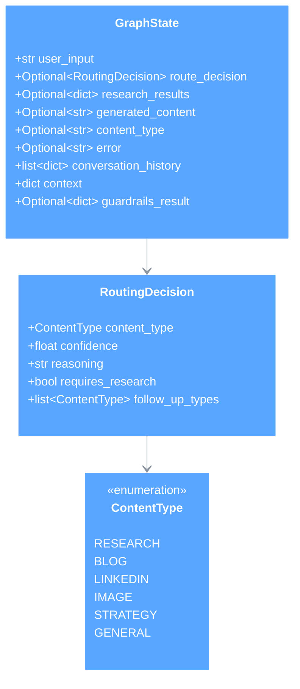

# 📊 GraphState Structure

This document describes the state management structure used in the REACH LangGraph workflow.

## Overview

The workflow uses a typed state dictionary (`GraphState`) to track information as it flows through the graph nodes. This state is passed between nodes and updated at each step.

## GraphState TypedDict

```python
class GraphState(TypedDict):
    """State for the LangGraph workflow."""
    
    user_input: str
    route_decision: Optional[RoutingDecision]
    research_results: Optional[dict[str, Any]]
    generated_content: Optional[str]
    content_type: Optional[str]
    error: Optional[str]
    conversation_history: list[dict[str, str]]
    context: dict[str, Any]
    guardrails_result: Optional[dict[str, Any]]
```

## Class Diagram



## Field Descriptions

### Core Fields

| Field | Type | Description |
|-------|------|-------------|
| `user_input` | `str` | The original user request text |
| `route_decision` | `Optional[RoutingDecision]` | The routing decision made by the content router |
| `generated_content` | `Optional[str]` | The content generated by the selected agent |
| `content_type` | `Optional[str]` | Type of content generated (research, blog, linkedin, etc.) |
| `error` | `Optional[str]` | Error message if something went wrong |

### Context Fields

| Field | Type | Description |
|-------|------|-------------|
| `conversation_history` | `list[dict[str, str]]` | Previous messages in the conversation |
| `context` | `dict[str, Any]` | Additional context data (property details, etc.) |
| `research_results` | `Optional[dict[str, Any]]` | Results from research agent if executed |

### Validation Fields

| Field | Type | Description |
|-------|------|-------------|
| `guardrails_result` | `Optional[dict[str, Any]]` | Results from guardrails validation |

## RoutingDecision Model

The `RoutingDecision` model contains the routing information:

```python
class RoutingDecision(BaseModel):
    """Model representing a routing decision."""
    
    content_type: ContentType
    confidence: float  # 0.0 to 1.0
    reasoning: str
    requires_research: bool
    follow_up_types: list[ContentType]
```

### Confidence Levels

| Level | Confidence | Source |
|-------|------------|--------|
| High | 0.9 | Pattern matching |
| Medium | 0.3-0.8 | Keyword scoring |
| Low | 0.6 | History context |
| Default | 0.5 | No match (general) |

### requires_research Flag

The `requires_research` flag is set to `True` for:
- BLOG content type (if "research" not in user input)
- LINKEDIN content type (if "research" not in user input)
- STRATEGY content type (if "research" not in user input)

### follow_up_types Suggestions

| Current Type | Suggested Follow-ups |
|--------------|---------------------|
| RESEARCH | BLOG, LINKEDIN, IMAGE |
| BLOG | LINKEDIN, IMAGE |
| LINKEDIN | IMAGE |
| IMAGE | (none) |
| STRATEGY | RESEARCH, BLOG, LINKEDIN |
| GENERAL | RESEARCH |

## ContentType Enum

```python
class ContentType(str, Enum):
    """Enumeration of content types that can be generated."""
    
    RESEARCH = "research"
    BLOG = "blog"
    LINKEDIN = "linkedin"
    IMAGE = "image"
    STRATEGY = "strategy"
    GENERAL = "general"
```

**Note:** Instagram is not a separate ContentType. Instagram routing is handled specially in the workflow's `_determine_next_node` method by checking for "instagram" or "caption" in the agent_type string.

## State Flow Through Nodes

```mermaid
%%{init: {'theme': 'base', 'themeVariables': { 'primaryColor': '#58a6ff', 'primaryTextColor': '#ffffff', 'primaryBorderColor': '#58a6ff', 'lineColor': '#8b949e', 'secondaryColor': '#21262d', 'tertiaryColor': '#161b22', 'background': '#0d1117'}}}%%
flowchart LR
    INIT[Initial State] --> GUARDRAILS[Guardrails Node]
    GUARDRAILS --> |Add guardrails_result| ROUTE[Route Node]
    ROUTE --> |Add route_decision| AGENT[Agent Node]
    AGENT --> |Add generated_content,<br/>content_type| END[Final State]

    style INIT fill:#58a6ff,stroke:#79c0ff,stroke-width:2px,color:#ffffff
    style GUARDRAILS fill:#d29922,stroke:#e3b341,stroke-width:2px,color:#ffffff
    style ROUTE fill:#a371f7,stroke:#bc8cff,stroke-width:2px,color:#ffffff
    style AGENT fill:#39d353,stroke:#56d364,stroke-width:2px,color:#ffffff
    style END fill:#3fb950,stroke:#56d364,stroke-width:2px,color:#ffffff
```



## Example State

```python
# Initial state
initial_state = {
    "user_input": "Write a blog post about home staging tips",
    "route_decision": None,
    "research_results": None,
    "generated_content": None,
    "content_type": None,
    "error": None,
    "conversation_history": [
        {"role": "user", "content": "Hello"},
        {"role": "assistant", "content": "Hi! How can I help?"}
    ],
    "context": {"property_type": "residential"},
    "guardrails_result": None,
}

# After guardrails node
state_after_guardrails = {
    ...initial_state,
    "guardrails_result": {
        "passed": True,
        "message": None,
        "blocked_by": None,
        "details": {...}
    }
}

# After route node
state_after_route = {
    ...state_after_guardrails,
    "route_decision": RoutingDecision(
        content_type=ContentType.BLOG,
        confidence=0.9,
        reasoning="Matched intent pattern",
        requires_research=True,
        follow_up_types=[ContentType.LINKEDIN, ContentType.IMAGE]
    )
}

# Final state
final_state = {
    ...state_after_route,
    "generated_content": "# Home Staging Tips\n\n...",
    "content_type": "blog"
}
```

## Related Documentation

- [Main Workflow](./01_main_workflow.md)
- [Content Router Logic](./04_content_router.md)
- [State Management](./07_state_management.md)