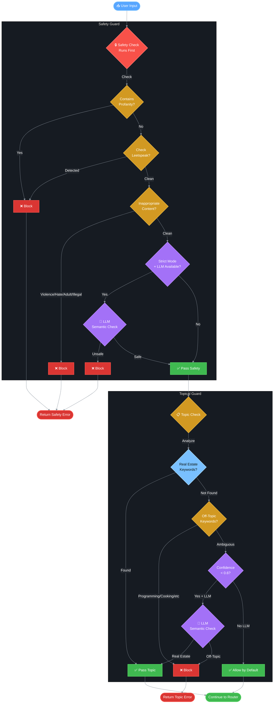

# 🛡️ Guardrails Decision Flow

This document describes the guardrails validation system in REACH that ensures all content is safe and on-topic.

## Overview

REACH implements two types of guardrails:
1. **Safety Guard** - Blocks profanity, offensive language, and inappropriate content
2. **Topical Guard** - Ensures requests are related to Real Estate

The guardrails run sequentially with safety checks first (fail-fast pattern).

## Guardrails Flow Diagram



## Safety Guard

The Safety Guard blocks inappropriate content using multiple detection methods.

### Detection Methods

1. **Direct Profanity Matching**
   - Regex pattern matching against known profanity words
   - Case-insensitive matching

2. **Leetspeak Detection**
   - Detects obfuscated profanity (e.g., "f*ck", "sh1t")
   - Pattern-based detection for common substitutions

3. **Inappropriate Content Categories**
   - Adult content (pornography, nudity, explicit)
   - Violence (gore, torture, abuse)
   - Illegal activities (drugs, fraud, hacking)
   - Discrimination (hate speech, slurs)

4. **Semantic Analysis (Strict Mode)**
   - Uses LLM to detect disguised or contextual inappropriate content
   - Only runs if `strict_mode=True` and LLM client is available

### Blocked Response

```
I cannot help create content with profanity, offensive language, 
or inappropriate material. Please rephrase your request using 
professional and appropriate language.
```

### Image-Specific Safety

For image generation requests, additional checks are performed:

```
I cannot generate images containing inappropriate, offensive, 
violent, or explicit content. Please describe a professional 
and appropriate image for your real estate needs.
```

## Topical Guard

The Topical Guard ensures all requests are related to Real Estate.

### Real Estate Keywords (Sample)

- **Property Types**: property, house, apartment, condo, townhouse, villa, mansion
- **Actions**: buy, sell, rent, invest, mortgage, financing
- **Professionals**: realtor, agent, broker, landlord, tenant
- **Concepts**: listing, appraisal, equity, foreclosure, staging

### Off-Topic Indicators (Sample)

- **Technology**: programming, coding, cryptocurrency, video games
- **Entertainment**: movies, music, celebrities, sports
- **Other**: recipes, cooking, fashion, travel, automotive

### Topic Detection Logic

1. **Keyword Matching**
   - Count real estate keywords in input
   - Count off-topic indicators in input
   - Calculate confidence score

2. **Semantic Analysis (Low Confidence)**
   - If confidence < 0.6 and LLM available
   - LLM determines if request is real estate related

3. **Default Behavior**
   - If no clear indicators and no LLM, allow by default

### Off-Topic Response

```
Sorry! I cannot help you with that topic. My expertise is in Real Estate. 
I can help you with property listings, real estate marketing, 
home buying/selling content, property descriptions, 
and real estate social media posts.
```

## GuardrailsManager

The `GuardrailsManager` class provides a unified interface for both guards.

### Initialization

```python
guardrails = GuardrailsManager(
    llm_client=gemini_client,
    enable_topical=True,
    enable_safety=True,
    strict_mode=True,
)
```

### Validation Methods

| Method | Description |
|--------|-------------|
| `validate_input(user_input, content_type)` | Validate user input against all guards |
| `validate_output(output, content_type)` | Validate generated output (safety only) |
| `validate_image_request(prompt)` | Validate image generation prompt |

### Validation Result

```python
{
    "passed": bool,           # True if all validations passed
    "message": str | None,    # Error message if blocked
    "blocked_by": str | None, # "safety" or "topical"
    "details": {
        "safety": {...},      # Safety check details
        "topical": {...},     # Topical check details
    }
}
```

## Configuration

### Enable/Disable Guards

```python
# Disable topical guard
guardrails.disable_guardrail("topical")

# Enable safety guard
guardrails.enable_guardrail("safety")
```

### Check Status

```python
status = guardrails.get_status()
# {
#     "topical_enabled": True,
#     "safety_enabled": True,
#     "llm_client_available": True,
#     "topical_guard_active": True,
#     "safety_guard_active": True,
# }
```

## Topic Suggestions

When a request is blocked as off-topic, users can get suggestions:

```python
suggestions = guardrails.get_topic_suggestions()
# [
#     "Write a property listing description for a 3-bedroom house",
#     "Create a LinkedIn post about home buying tips",
#     "Research current real estate market trends",
#     ...
# ]
```

## Related Documentation

- [Main Workflow](./01_main_workflow.md)
- [Error Handling](./09_error_handling.md)