# 🎯 Content Router Decision Logic

This document describes the content routing system that determines which agent handles each user request.

## Overview

The Content Router analyzes user input and routes it to the most appropriate agent. It uses a multi-tier approach:
1. **Pattern Matching** (highest priority, confidence=0.9)
2. **Keyword Scoring** (medium priority, confidence=0.3-0.8)
3. **History Context** (lower priority, confidence=0.6)
4. **Default Fallback** (lowest priority, confidence=0.5)

## Router Flow Diagram

```mermaid
%%{init: {'theme': 'base', 'themeVariables': { 'primaryColor': '#58a6ff', 'primaryTextColor': '#ffffff', 'primaryBorderColor': '#58a6ff', 'lineColor': '#8b949e', 'secondaryColor': '#21262d', 'tertiaryColor': '#161b22', 'background': '#0d1117'}}}%%
flowchart TD
    REQUEST([📥 Validated Request]) --> PATTERN_MATCH[🔍 Pattern Matching<br/>High Priority]
    
    PATTERN_MATCH --> RESEARCH_PATTERN{Matches:<br/>'research/find/look up...'<br/>patterns?}
    RESEARCH_PATTERN -->|Yes| RESEARCH_AGENT[🔍 Research Agent<br/>confidence=0.9]
    RESEARCH_PATTERN -->|No| BLOG_PATTERN
    
    BLOG_PATTERN{Matches:<br/>'write/create blog/article...'<br/>patterns?}
    BLOG_PATTERN -->|Yes| BLOG_AGENT[📝 Blog Writer<br/>confidence=0.9]
    BLOG_PATTERN -->|No| LINKEDIN_PATTERN
    
    LINKEDIN_PATTERN{Matches:<br/>'linkedin post/professional...'<br/>patterns?}
    LINKEDIN_PATTERN -->|Yes| LINKEDIN_AGENT[💼 LinkedIn Writer<br/>confidence=0.9]
    LINKEDIN_PATTERN -->|No| IMAGE_PATTERN
    
    IMAGE_PATTERN{Matches:<br/>'create/generate image...'<br/>patterns?}
    IMAGE_PATTERN -->|Yes| IMAGE_AGENT[🖼️ Image Generator<br/>confidence=0.9]
    IMAGE_PATTERN -->|No| STRATEGY_PATTERN
    
    STRATEGY_PATTERN{Matches:<br/>'create strategy/plan...'<br/>patterns?}
    STRATEGY_PATTERN -->|Yes| STRATEGY_AGENT[📊 Content Strategist<br/>confidence=0.9]
    STRATEGY_PATTERN -->|No| KEYWORD_SCORING[🏷️ Keyword Scoring<br/>Lower Priority]
    
    KEYWORD_SCORING --> SCORE_KEYWORDS[Score all ContentType<br/>keywords in text]
    SCORE_KEYWORDS --> BEST_MATCH{Best Match<br/>Score > 0?}
    BEST_MATCH -->|Yes| KEYWORD_ROUTE[Route to Best Match<br/>confidence=0.3-0.8]
    BEST_MATCH -->|No| CHECK_HISTORY[📜 Check Conversation<br/>History]
    
    CHECK_HISTORY --> HISTORY_CONTEXT{Found Context<br/>in Last 3 Messages?}
    HISTORY_CONTEXT -->|Yes| HISTORY_ROUTE[Route Based on Context<br/>confidence=0.6]
    HISTORY_CONTEXT -->|No| GENERAL_AGENT[🤖 Query Handler<br/>confidence=0.5]

    style REQUEST fill:#58a6ff,stroke:#79c0ff,stroke-width:2px,color:#ffffff
    style PATTERN_MATCH fill:#a371f7,stroke:#bc8cff,stroke-width:2px,color:#ffffff
    style RESEARCH_PATTERN fill:#d29922,stroke:#e3b341,stroke-width:2px,color:#ffffff
    style BLOG_PATTERN fill:#d29922,stroke:#e3b341,stroke-width:2px,color:#ffffff
    style LINKEDIN_PATTERN fill:#d29922,stroke:#e3b341,stroke-width:2px,color:#ffffff
    style IMAGE_PATTERN fill:#d29922,stroke:#e3b341,stroke-width:2px,color:#ffffff
    style STRATEGY_PATTERN fill:#d29922,stroke:#e3b341,stroke-width:2px,color:#ffffff
    style RESEARCH_AGENT fill:#39d353,stroke:#56d364,stroke-width:2px,color:#ffffff
    style BLOG_AGENT fill:#39d353,stroke:#56d364,stroke-width:2px,color:#ffffff
    style LINKEDIN_AGENT fill:#39d353,stroke:#56d364,stroke-width:2px,color:#ffffff
    style IMAGE_AGENT fill:#39d353,stroke:#56d364,stroke-width:2px,color:#ffffff
    style STRATEGY_AGENT fill:#39d353,stroke:#56d364,stroke-width:2px,color:#ffffff
    style KEYWORD_SCORING fill:#79c0ff,stroke:#a5d6ff,stroke-width:2px,color:#0d1117
    style SCORE_KEYWORDS fill:#79c0ff,stroke:#a5d6ff,stroke-width:2px,color:#0d1117
    style BEST_MATCH fill:#d29922,stroke:#e3b341,stroke-width:2px,color:#ffffff
    style KEYWORD_ROUTE fill:#fb8f44,stroke:#ffa657,stroke-width:2px,color:#ffffff
    style CHECK_HISTORY fill:#8b949e,stroke:#b1bac4,stroke-width:2px,color:#ffffff
    style HISTORY_CONTEXT fill:#d29922,stroke:#e3b341,stroke-width:2px,color:#ffffff
    style HISTORY_ROUTE fill:#fb8f44,stroke:#ffa657,stroke-width:2px,color:#ffffff
    style GENERAL_AGENT fill:#8b949e,stroke:#b1bac4,stroke-width:2px,color:#ffffff
```



## Pattern Matching

Pattern matching uses compiled regex patterns for high-confidence routing.

### Research Patterns

```python
[
    r"(?:can you |please )?(?:research|find|look up|search for)\s+.+",
    r"what (?:is|are|does|do)\s+.+",
    r"tell me (?:about|more about)\s+.+",
    r"i (?:want|need) (?:to know|information) about\s+.+",
]
```

### Blog Patterns

```python
[
    r"(?:write|create|generate) (?:a |an )?(?:blog|article|post)\s+.+",
    r"(?:blog|article) (?:about|on)\s+.+",
    r"seo (?:content|article|blog)\s+.+",
]
```

### LinkedIn Patterns

```python
[
    r"(?:write|create|generate) (?:a )?linkedin (?:post|content)\s*.*",
    r"linkedin (?:post|content) (?:about|on)\s+.+",
    r"professional (?:post|content) (?:about|for)\s+.+",
]
```

### Image Patterns

```python
[
    r"(?:create|generate|make) (?:a |an )?(?:image|picture|visual|graphic)\s+.+",
    r"(?:image|picture|visual) (?:of|for|about)\s+.+",
    r"design (?:a |an )?.+",
]
```

### Strategy Patterns

```python
[
    r"(?:create|develop|build) (?:a )?(?:content )?strategy\s*.*",
    r"(?:marketing|content) plan (?:for|about)\s+.+",
    r"campaign (?:for|about)\s+.+",
]
```

## Keyword Scoring

When pattern matching fails, the router scores keywords for each content type.

### Keywords by Content Type

| ContentType | Keywords (Sample) |
|-------------|-------------------|
| RESEARCH | research, find, search, look up, investigate, analyze, study, explore, what is, how does, explain, information, data, facts, statistics, trends |
| BLOG | blog, article, post, write, content, seo, long-form, guide, tutorial, how-to, listicle, review, comparison, pillar, evergreen |
| LINKEDIN | linkedin, professional, network, career, business post, thought leadership, engagement, social media, b2b, corporate, industry |
| IMAGE | image, picture, visual, graphic, illustration, photo, design, create image, generate image, artwork, banner, thumbnail, infographic |
| STRATEGY | strategy, plan, campaign, marketing, content calendar, roadmap, outline, framework, approach, methodology |

### Scoring Algorithm

```python
def _score_keywords(self, text: str) -> dict[ContentType, int]:
    scores = {}
    for content_type, keywords in self.CONTENT_KEYWORDS.items():
        score = sum(1 for keyword in keywords if keyword in text)
        if score > 0:
            scores[content_type] = score
    return scores
```

### Confidence Calculation

```python
confidence = min(0.8, 0.3 + (best_score * 0.1))
```

## History Context

If no keywords match, the router checks conversation history.

```python
def _infer_from_history(self, conversation_history: list[dict]) -> Optional[ContentType]:
    # Look at the last 3 messages for context
    recent_messages = conversation_history[-3:]
    for message in reversed(recent_messages):
        content = message.get("content", "").lower()
        for content_type, keywords in self.CONTENT_KEYWORDS.items():
            if any(keyword in content for keyword in keywords[:5]):
                return content_type
    return None
```

## Agent Selection Priority

| Priority | ContentType | Agent | Confidence |
|----------|-------------|-------|------------|
| 1 | RESEARCH | Research Agent | 0.9 (pattern) / 0.3-0.8 (keyword) |
| 2 | BLOG | Blog Writer | 0.9 (pattern) / 0.3-0.8 (keyword) |
| 3 | LINKEDIN | LinkedIn Writer | 0.9 (pattern) / 0.3-0.8 (keyword) |
| 4 | IMAGE | Image Generator | 0.9 (pattern) / 0.3-0.8 (keyword) |
| 5 | STRATEGY | Content Strategist | 0.9 (pattern) / 0.3-0.8 (keyword) |
| 6 | GENERAL | Query Handler | 0.5 (default) |

**Note:** Instagram routing is handled specially in the workflow's `_determine_next_node` method by checking for "instagram" or "caption" in the agent_type string, not as a separate ContentType.

## Routing Decision Model

```mermaid
%%{init: {'theme': 'base', 'themeVariables': { 'primaryColor': '#58a6ff', 'primaryTextColor': '#ffffff', 'primaryBorderColor': '#58a6ff', 'lineColor': '#8b949e', 'secondaryColor': '#21262d', 'tertiaryColor': '#161b22', 'background': '#0d1117'}}}%%
classDiagram
    class RoutingDecision {
        +ContentType content_type
        +float confidence
        +str reasoning
        +bool requires_research
        +list~ContentType~ follow_up_types
    }
    
    class ContentType {
        <<enumeration>>
        RESEARCH
        BLOG
        LINKEDIN
        IMAGE
        STRATEGY
        GENERAL
    }
    
    RoutingDecision --> ContentType
    
    note for RoutingDecision "requires_research is True for BLOG, LINKEDIN, STRATEGY\nif 'research' not in user input"
    
    note for RoutingDecision "follow_up_types suggests next content types:\n- RESEARCH → BLOG, LINKEDIN, IMAGE\n- BLOG → LINKEDIN, IMAGE\n- LINKEDIN → IMAGE\n- STRATEGY → RESEARCH, BLOG, LINKEDIN"
```



## Follow-up Suggestions

The router suggests follow-up content types based on the current type:

| Current Type | Suggested Follow-ups |
|--------------|---------------------|
| RESEARCH | BLOG, LINKEDIN, IMAGE |
| BLOG | LINKEDIN, IMAGE |
| LINKEDIN | IMAGE |
| IMAGE | (none) |
| STRATEGY | RESEARCH, BLOG, LINKEDIN |
| GENERAL | RESEARCH |

## requires_research Flag

The `requires_research` flag indicates if research should be done first:

```python
requires_research = content_type in [
    ContentType.BLOG,
    ContentType.LINKEDIN,
    ContentType.STRATEGY,
] and "research" not in user_input.lower()
```

## Usage Example

```python
router = ContentRouter()

# Route a request
decision = router.route(
    user_input="Write a blog post about home staging tips",
    context={"property_type": "residential"},
    conversation_history=[...]
)

# Result
# RoutingDecision(
#     content_type=ContentType.BLOG,
#     confidence=0.9,
#     reasoning="Matched intent pattern",
#     requires_research=True,
#     follow_up_types=[ContentType.LINKEDIN, ContentType.IMAGE]
# )
```

## Agent Mapping

```python
def get_agent_for_type(self, content_type: ContentType) -> str:
    agent_mapping = {
        ContentType.RESEARCH: "research_agent",
        ContentType.BLOG: "blog_writer_agent",
        ContentType.LINKEDIN: "linkedin_writer_agent",
        ContentType.IMAGE: "image_generator_agent",
        ContentType.STRATEGY: "content_strategist_agent",
        ContentType.GENERAL: "query_handler_agent",
    }
    return agent_mapping.get(content_type, "query_handler_agent")
```

## Related Documentation

- [Main Workflow](./01_main_workflow.md)
- [GraphState Structure](./02_graph_state.md)
- [Agent Routing](./06_agent_routing.md)