# 📸 Instagram Post Generation Flow

This document describes the Instagram post generation workflow in REACH.

## Overview

REACH provides specialized methods for generating Instagram content:
- **Full Instagram Post** - Image + Caption + Hashtags
- **Caption Only** - Caption + Hashtags (no image)
- **Image Only** - Via the standard image generation flow

## Instagram Post Generation Flow

```mermaid
flowchart TD
    START([📸 Instagram Post Request]) --> VALIDATE_INPUT{🛡️ Validate Input<br/>Guardrails}
    
    VALIDATE_INPUT -->|Blocked| ERROR[❌ Return Error]
    VALIDATE_INPUT -->|Passed| IMAGE_SAFETY{🖼️ Image Safety<br/>Check}
    
    IMAGE_SAFETY -->|Unsafe| ERROR
    IMAGE_SAFETY -->|Safe| OPTIONS{Generation Options}
    
    OPTIONS -->|generate_instagram_post| BOTH[Generate Both]
    OPTIONS -->|generate_instagram_caption| CAPTION_ONLY[Caption Only]
    OPTIONS -->|run with image keywords| IMAGE_ONLY[Image Only]
    
    BOTH --> GEN_IMAGE[🖼️ Generate Image<br/>via ImageGeneratorAgent]
    GEN_IMAGE --> GEN_CAPTION[📝 Generate Caption<br/>via InstagramWriter.generate_for_image]
    GEN_CAPTION --> ADD_HASHTAGS[#️⃣ Add Hashtags]
    
    CAPTION_ONLY --> GEN_CAPTION_SOLO[📝 Generate Caption<br/>via InstagramWriter.generate]
    GEN_CAPTION_SOLO --> SPLIT_HASHTAGS[Split Caption & Hashtags]
    
    IMAGE_ONLY --> GEN_IMAGE_SOLO[🖼️ Generate Image<br/>via ImageGeneratorAgent]
    
    ADD_HASHTAGS --> VALIDATE_OUTPUT{🛡️ Validate Output}
    SPLIT_HASHTAGS --> VALIDATE_OUTPUT
    GEN_IMAGE_SOLO --> VALIDATE_OUTPUT
    
    VALIDATE_OUTPUT -->|Safe| COMBINE[📦 Combine Results]
    VALIDATE_OUTPUT -->|Unsafe| FALLBACK[🔄 Use Fallback Caption]
    FALLBACK --> COMBINE
    
    COMBINE --> RETURN([✅ Return Instagram Post])
    ERROR --> END([📤 Return to User])
    RETURN --> END

    style START fill:#e3f2fd
    style ERROR fill:#ffcdd2
    style RETURN fill:#c8e6c9
    style GEN_IMAGE fill:#fff3e0
    style GEN_CAPTION fill:#fff3e0
    style ADD_HASHTAGS fill:#e8f5e9
    style FALLBACK fill:#fff3e0
```



## API Methods

### generate_instagram_post

Generates a complete Instagram post with image and caption.

```python
async def generate_instagram_post(
    self,
    image_description: str,
    property_details: Optional[dict[str, Any]] = None,
    session_id: Optional[str] = None,
) -> dict[str, Any]:
```

**Parameters:**
| Parameter | Type | Description |
|-----------|------|-------------|
| `image_description` | `str` | Description of the property image to generate |
| `property_details` | `Optional[dict]` | Property details (location, price, features) |
| `session_id` | `Optional[str]` | Session ID for conversation continuity |

**Returns:**
```python
{
    "success": bool,
    "image": str,           # Image URL or base64 data
    "caption": str,         # Main caption text
    "hashtags": str,        # Hashtag string
    "full_post": str,       # Caption + Hashtags combined
    "session_id": str,
    "guardrails": {
        "blocked": bool,
        "blocked_by": str | None
    }
}
```

**Example:**
```python
result = await graph.generate_instagram_post(
    image_description="Modern kitchen with granite countertops and stainless steel appliances",
    property_details={
        "location": "San Francisco, CA",
        "price": "$1,200,000",
        "bedrooms": 3,
        "bathrooms": 2
    }
)

# Result:
# {
#     "success": True,
#     "image": "https://...",
#     "caption": "✨ Dream kitchen goals! This stunning modern kitchen features...",
#     "hashtags": "#realestate #dreamhome #modernkitchen #sanfrancisco #luxuryhome",
#     "full_post": "✨ Dream kitchen goals! This stunning modern kitchen features...\n\n#realestate #dreamhome #modernkitchen #sanfrancisco #luxuryhome",
#     "session_id": "abc123",
#     "guardrails": {"blocked": False}
# }
```

### generate_instagram_caption

Generates only an Instagram caption with hashtags (no image).

```python
async def generate_instagram_caption(
    self,
    content_description: str,
    context: Optional[dict[str, Any]] = None,
    session_id: Optional[str] = None,
) -> dict[str, Any]:
```

**Parameters:**
| Parameter | Type | Description |
|-----------|------|-------------|
| `content_description` | `str` | Description of the content |
| `context` | `Optional[dict]` | Additional context (property details, etc.) |
| `session_id` | `Optional[str]` | Session ID for conversation continuity |

**Returns:**
```python
{
    "success": bool,
    "caption": str,         # Main caption text
    "hashtags": str,        # Hashtag string
    "full_post": str,       # Caption + Hashtags combined
    "session_id": str,
    "guardrails": {
        "blocked": bool,
        "blocked_by": str | None
    }
}
```

**Example:**
```python
result = await graph.generate_instagram_caption(
    content_description="Just sold this beautiful 3-bedroom home in the heart of downtown",
    context={"property_type": "residential", "sale_type": "just_sold"}
)

# Result:
# {
#     "success": True,
#     "caption": "🎉 JUST SOLD! Another happy family found their dream home...",
#     "hashtags": "#justsold #realestate #realtor #dreamhome #homesweethome",
#     "full_post": "🎉 JUST SOLD! Another happy family found their dream home...\n\n#justsold #realestate #realtor #dreamhome #homesweethome",
#     "session_id": "abc123",
#     "guardrails": {"blocked": False}
# }
```

## Validation Steps

### 1. Input Validation

Both methods validate input against guardrails:

```python
if self.guardrails:
    input_check = await self.guardrails.validate_input(image_description, "image")
    if not input_check["passed"]:
        return {
            "success": False,
            "error": input_check["message"],
            "guardrails": {"blocked": True, "blocked_by": input_check["blocked_by"]},
        }
```

### 2. Image Safety Check

For image generation, additional safety checks are performed:

```python
if self.guardrails:
    image_check = await self.guardrails.validate_image_request(image_description)
    if not image_check["passed"]:
        return {
            "success": False,
            "error": image_check["message"],
            "guardrails": {"blocked": True, "blocked_by": "safety"},
        }
```

### 3. Output Validation

Generated captions are validated before returning:

```python
if self.guardrails:
    output_check = await self.guardrails.validate_output(caption_result["full_post"])
    if not output_check["passed"]:
        # Use fallback caption
        caption_result = {
            "caption": "Beautiful property! Contact us for more details. 🏠",
            "hashtags": "#realestate #property #home #dreamhome #realtor",
            "full_post": "Beautiful property! Contact us for more details. 🏠\n\n#realestate #property #home #dreamhome #realtor",
        }
```

## Fallback Caption

If output validation fails, a safe fallback caption is used:

```python
{
    "caption": "Beautiful property! Contact us for more details. 🏠",
    "hashtags": "#realestate #property #home #dreamhome #realtor",
    "full_post": "Beautiful property! Contact us for more details. 🏠\n\n#realestate #property #home #dreamhome #realtor"
}
```

## Instagram Writer Agent

The `InstagramWriterAgent` provides two methods:

### generate

Standard generation method for captions:

```python
result = await self.instagram_writer.generate(user_input, context)
```

### generate_for_image

Specialized method for generating captions for a specific image:

```python
caption_result = await self.instagram_writer.generate_for_image(
    image_prompt=image_description,
    image_url=image_result if isinstance(image_result, str) and image_result.startswith("http") else None,
    property_details=property_details,
)
```

**Returns:**
```python
{
    "caption": str,
    "hashtags": str,
    "full_post": str
}
```

## Caption Splitting

For caption-only generation, the result is split into caption and hashtags:

```python
# Split caption and hashtags
parts = caption.rsplit("\n\n", 1)
main_caption = parts[0]
hashtags = parts[1] if len(parts) > 1 and "#" in parts[1] else ""
```

## Error Handling

Errors are caught and returned with appropriate messages:

```python
except Exception as e:
    logger.error(f"Instagram post generation error: {str(e)}")
    return {
        "success": False,
        "error": str(e),
        "guardrails": {"blocked": False},
    }
```

## Related Documentation

- [Main Workflow](./01_main_workflow.md)
- [Guardrails](./03_guardrails.md)
- [Agent Routing](./06_agent_routing.md)