# 🤖 Agent Routing

This document describes how requests are routed to specific agents in the REACH workflow.

## Overview

After the Content Router determines the content type, the workflow's `_determine_next_node` method maps the routing decision to a specific agent node. Some agents (Blog, Instagram) now include **automatic image generation**.

## Agent Routing Flow

```mermaid
%%{init: {'theme': 'base', 'themeVariables': { 'primaryColor': '#58a6ff', 'primaryTextColor': '#ffffff', 'primaryBorderColor': '#58a6ff', 'lineColor': '#8b949e', 'secondaryColor': '#21262d', 'tertiaryColor': '#161b22', 'background': '#0d1117'}}}%%
flowchart TD
    ROUTE_DECISION[RoutingDecision] --> DETERMINE{_determine_next_node}
    
    DETERMINE -->|error in state| END_NODE[END]
    DETERMINE -->|no route_decision| GENERAL_NODE[general]
    
    DETERMINE -->|content_type = research| RESEARCH_NODE[research]
    DETERMINE -->|content_type = blog| BLOG_NODE[blog]
    DETERMINE -->|content_type = linkedin| LINKEDIN_NODE[linkedin]
    DETERMINE -->|content_type = instagram| INSTAGRAM_NODE[instagram]
    DETERMINE -->|content_type = image| IMAGE_NODE[image]
    DETERMINE -->|content_type = strategy| STRATEGY_NODE[strategy]
    DETERMINE -->|default| GENERAL_NODE
    
    RESEARCH_NODE --> RESEARCH_AGENT[🔍 ResearchAgent<br/>Text Only]
    BLOG_NODE --> BLOG_AGENT[📝 BlogWriterAgent<br/>+ Header Image 16:9]
    LINKEDIN_NODE --> LINKEDIN_AGENT[💼 LinkedInWriterAgent<br/>Text Only]
    INSTAGRAM_NODE --> INSTAGRAM_AGENT[📸 InstagramWriterAgent<br/>+ Post Image 1:1]
    IMAGE_NODE --> IMAGE_AGENT[🖼️ ImageGeneratorAgent<br/>Custom Aspect Ratio]
    STRATEGY_NODE --> STRATEGY_AGENT[📊 ContentStrategistAgent<br/>Text Only]
    GENERAL_NODE --> QUERY_AGENT[🤖 QueryHandlerAgent<br/>Text Only]

    style ROUTE_DECISION fill:#58a6ff,stroke:#79c0ff,stroke-width:2px,color:#ffffff
    style DETERMINE fill:#a371f7,stroke:#bc8cff,stroke-width:2px,color:#ffffff
    style END_NODE fill:#da3633,stroke:#f85149,stroke-width:2px,color:#ffffff
    style GENERAL_NODE fill:#8b949e,stroke:#b1bac4,stroke-width:2px,color:#ffffff
    style RESEARCH_NODE fill:#39d353,stroke:#56d364,stroke-width:2px,color:#ffffff
    style BLOG_NODE fill:#39d353,stroke:#56d364,stroke-width:2px,color:#ffffff
    style LINKEDIN_NODE fill:#39d353,stroke:#56d364,stroke-width:2px,color:#ffffff
    style INSTAGRAM_NODE fill:#f778ba,stroke:#ff9bce,stroke-width:2px,color:#ffffff
    style IMAGE_NODE fill:#39d353,stroke:#56d364,stroke-width:2px,color:#ffffff
    style STRATEGY_NODE fill:#39d353,stroke:#56d364,stroke-width:2px,color:#ffffff
    style RESEARCH_AGENT fill:#3fb950,stroke:#56d364,stroke-width:2px,color:#ffffff
    style BLOG_AGENT fill:#fb8f44,stroke:#ffa657,stroke-width:2px,color:#ffffff
    style LINKEDIN_AGENT fill:#3fb950,stroke:#56d364,stroke-width:2px,color:#ffffff
    style INSTAGRAM_AGENT fill:#fb8f44,stroke:#ffa657,stroke-width:2px,color:#ffffff
    style IMAGE_AGENT fill:#fb8f44,stroke:#ffa657,stroke-width:2px,color:#ffffff
    style STRATEGY_AGENT fill:#3fb950,stroke:#56d364,stroke-width:2px,color:#ffffff
    style QUERY_AGENT fill:#3fb950,stroke:#56d364,stroke-width:2px,color:#ffffff
```



## _determine_next_node Implementation

```python
def _determine_next_node(
    self,
    state: GraphState,
) -> Literal["research", "blog", "linkedin", "instagram", "image", "strategy", "general", "end"]:
    """Determine the next node based on route decision."""
    if state.get("error"):
        return "end"

    route = state.get("route_decision")
    if not route:
        return "general"

    content_type = route.content_type.value if hasattr(route.content_type, "value") else str(route.content_type)

    if content_type == "research":
        return "research"
    if content_type == "blog":
        return "blog"
    if content_type == "linkedin":
        return "linkedin"
    if content_type == "instagram":
        return "instagram"
    if content_type == "image":
        return "image"
    if content_type == "strategy":
        return "strategy"
    return "general"
```

## Available Agents

### 🔍 Research Agent

**Purpose:** Research topics using SERP API and synthesize findings.

**Image Generation:** ❌ None

**Initialization:**
```python
self.research_agent = ResearchAgent(
    llm_client=self.gemini_client,
    serp_client=self.serp_client,
)
```

**Node Implementation:**
```python
async def _research_node(self, state: GraphState) -> GraphState:
    result = await self.research_agent.generate(user_input, context)
    return {
        **state,
        "generated_content": result,
        "content_type": "research",
        "research_results": {"summary": result},
    }
```

### 📝 Blog Writer Agent

**Purpose:** Write SEO-optimized blog posts with automatic header images.

**Image Generation:** ✅ 16:9 Header Image

**Initialization:**
```python
self.blog_writer = BlogWriterAgent(
    llm_client=self.gemini_client,
    image_client=self.imagen_client,
)
```

**Node Implementation:**
```python
async def _blog_node(self, state: GraphState) -> GraphState:
    # Step 1: Generate blog content
    blog_content = await self.blog_writer.generate(user_input, context)
    
    # Step 2: Extract title for image generation
    title_match = re.search(r'^#\s+(.+)$', blog_content, re.MULTILINE)
    blog_title = title_match.group(1) if title_match else user_input
    
    # Step 3: Generate header image (16:9)
    if should_generate_image:
        image_prompt = f"Create a professional blog header image for: {blog_title}"
        image_result = await self.image_generator.generate(
            image_prompt,
            context={"style": "professional", "aspect_ratio": "16:9"},
        )
        # Extract data URI from result
        data_uri_match = re.search(r'(data:image/[^;\s]+;base64,[A-Za-z0-9+/=]+)', str(image_result))
        if data_uri_match:
            image_data_uri = data_uri_match.group(1)
    
    # Step 4: Combine image + blog
    if image_data_uri:
        full_content = f"\n\n{blog_content}"
    else:
        full_content = blog_content
    
    return {
        **state,
        "generated_content": full_content,
        "content_type": "blog",
    }
```

### 💼 LinkedIn Writer Agent

**Purpose:** Create professional LinkedIn posts.

**Image Generation:** ❌ None

**Initialization:**
```python
self.linkedin_writer = LinkedInWriterAgent(llm_client=self.gemini_client)
```

**Node Implementation:**
```python
async def _linkedin_node(self, state: GraphState) -> GraphState:
    result = await self.linkedin_writer.generate(user_input, context)
    return {
        **state,
        "generated_content": result,
        "content_type": "linkedin",
    }
```

### 📸 Instagram Writer Agent

**Purpose:** Generate Instagram posts with images and captions.

**Image Generation:** ✅ 1:1 Square Image

**Initialization:**
```python
self.instagram_writer = InstagramWriterAgent(llm_client=self.gemini_client)
```

**Node Implementation:**
```python
async def _instagram_node(self, state: GraphState) -> GraphState:
    # Step 1: Generate image (1:1 aspect ratio)
    if should_generate_image:
        image_result = await self.image_generator.generate(
            f"Generate a photorealistic real estate image for Instagram: {user_input}",
            context={"style": "professional", "aspect_ratio": "1:1"},
        )
        # Extract data URI
        data_uri_match = re.search(r'(data:image/[^;\s]+;base64,[A-Za-z0-9+/=]+)', str(image_result))
        if data_uri_match:
            image_data_uri = data_uri_match.group(1)
    
    # Step 2: Generate caption with hashtags
    caption_result = await self.instagram_writer.generate(user_input, context)
    
    # Step 3: Format as Instagram post
    if image_data_uri:
        full_content = f"""## 📸 Instagram Post

### 🖼️ Generated Image


### 📝 Caption

{caption_result}
"""
    else:
        full_content = f"""## 📸 Instagram Post

### 📝 Caption

{caption_result}

*Note: Image generation was not available for this request.*
"""
    
    return {
        **state,
        "generated_content": full_content,
        "content_type": "instagram",
    }
```

### 🖼️ Image Generator Agent

**Purpose:** Generate property images using Imagen.

**Image Generation:** ✅ Custom Aspect Ratio

**Initialization:**
```python
self.image_generator = ImageGeneratorAgent(
    llm_client=self.gemini_client,
    image_client=self.imagen_client,
)
```

**Node Implementation:**
```python
async def _image_node(self, state: GraphState) -> GraphState:
    # Additional image safety check
    if self.guardrails:
        image_check = await self.guardrails.validate_image_request(user_input)
        if not image_check["passed"]:
            return {
                **state,
                "generated_content": image_check["message"],
                "content_type": "image_blocked",
            }

    result = await self.image_generator.generate(user_input, context)
    return {
        **state,
        "generated_content": result,
        "content_type": "image",
    }
```

### 📊 Content Strategist Agent

**Purpose:** Create content strategies and marketing plans.

**Image Generation:** ❌ None

**Initialization:**
```python
self.content_strategist = ContentStrategistAgent(llm_client=self.gemini_client)
```

**Node Implementation:**
```python
async def _strategy_node(self, state: GraphState) -> GraphState:
    result = await self.content_strategist.generate(user_input, context)
    return {
        **state,
        "generated_content": result,
        "content_type": "strategy",
    }
```

### 🤖 Query Handler Agent

**Purpose:** Handle general queries and fallback requests.

**Image Generation:** ❌ None

**Initialization:**
```python
self.query_handler = QueryHandlerAgent(llm_client=self.gemini_client)
```

**Node Implementation:**
```python
async def _general_node(self, state: GraphState) -> GraphState:
    result = await self.query_handler.generate(user_input, context)
    return {
        **state,
        "generated_content": result,
        "content_type": "general",
    }
```

## Agent Summary Table

| Agent | Content Type | Image Generation | Aspect Ratio | Streaming |
|-------|--------------|------------------|--------------|-----------|
| 🔍 Research | research | ❌ | - | ✅ Yes |
| 📝 Blog Writer | blog | ✅ Header | 16:9 | ❌ No |
| 💼 LinkedIn Writer | linkedin | ❌ | - | ✅ Yes |
| 📸 Instagram Writer | instagram | ✅ Post | 1:1 | ❌ No |
| 🖼️ Image Generator | image | ✅ Custom | User-defined | ❌ No |
| 📊 Content Strategist | strategy | ❌ | - | ✅ Yes |
| 🤖 Query Handler | general | ❌ | - | ✅ Yes |

## Output Validation

All agent nodes validate output against safety guardrails:

```python
# Validate output
if self.guardrails:
    output_check = await self.guardrails.validate_output(result)
    if not output_check["passed"]:
        result = "I apologize, but I cannot provide that response. Please try a different query."
```

## Graph Node Configuration

The LangGraph workflow is configured with conditional edges:

```python
def _build_graph(self) -> StateGraph:
    workflow = StateGraph(GraphState)

    # Add nodes
    workflow.add_node("guardrails", self._guardrails_node)
    workflow.add_node("route", self._route_node)
    workflow.add_node("research", self._research_node)
    workflow.add_node("blog", self._blog_node)
    workflow.add_node("linkedin", self._linkedin_node)
    workflow.add_node("instagram", self._instagram_node)
    workflow.add_node("image", self._image_node)
    workflow.add_node("strategy", self._strategy_node)
    workflow.add_node("general", self._general_node)

    # Set entry point
    workflow.set_entry_point("guardrails")

    # Conditional edges from guardrails
    workflow.add_conditional_edges(
        "guardrails",
        self._check_guardrails_passed,
        {"passed": "route", "blocked": END},
    )

    # Conditional edges from route
    workflow.add_conditional_edges(
        "route",
        self._determine_next_node,
        {
            "research": "research",
            "blog": "blog",
            "linkedin": "linkedin",
            "instagram": "instagram",
            "image": "image",
            "strategy": "strategy",
            "general": "general",
            "end": END,
        },
    )

    # All content nodes go to END
    workflow.add_edge("research", END)
    workflow.add_edge("blog", END)
    workflow.add_edge("linkedin", END)
    workflow.add_edge("instagram", END)
    workflow.add_edge("image", END)
    workflow.add_edge("strategy", END)
    workflow.add_edge("general", END)

    return workflow.compile()
```

## Agent Initialization

All agents are initialized in `_init_agents()`:

```python
def _init_agents(self) -> None:
    """Initialize all agents."""
    self.query_handler = QueryHandlerAgent(llm_client=self.gemini_client)
    self.research_agent = ResearchAgent(
        llm_client=self.gemini_client,
        serp_client=self.serp_client,
    )
    self.blog_writer = BlogWriterAgent(
        llm_client=self.gemini_client,
        image_client=self.imagen_client,
    )
    self.linkedin_writer = LinkedInWriterAgent(llm_client=self.gemini_client)
    self.instagram_writer = InstagramWriterAgent(llm_client=self.gemini_client)
    self.image_generator = ImageGeneratorAgent(
        llm_client=self.gemini_client,
        image_client=self.imagen_client,
    )
    self.content_strategist = ContentStrategistAgent(llm_client=self.gemini_client)
```

## Related Documentation

- [Main Workflow](./01_main_workflow.md)
- [Content Router](./04_content_router.md)
- [Instagram Flow](./05_instagram_flow.md)
- [GraphState Structure](./02_graph_state.md)