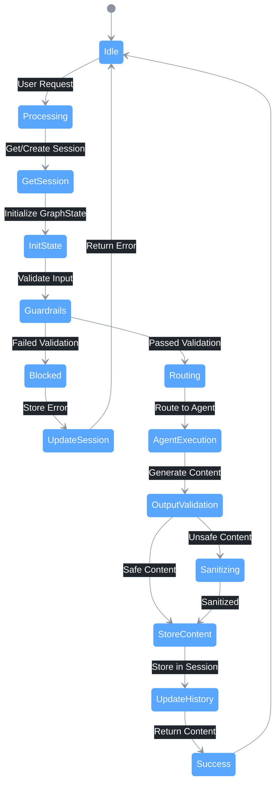
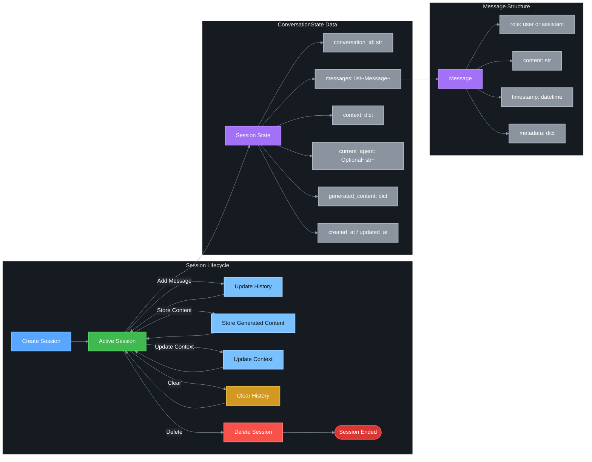

# 📋 State Management

This document describes the session and conversation state management in REACH.

## Overview

REACH uses a session-based state management system to:
- Track conversation history across multiple interactions
- Store generated content for reference
- Maintain context between requests
- Support multiple concurrent users

## State Management Diagram



## Session State Flow



## ConversationState Class

The `ConversationState` dataclass manages individual conversation sessions:

```python
@dataclass
class ConversationState:
    """Manages the state of a single conversation."""
    
    conversation_id: str = field(default_factory=lambda: str(uuid.uuid4()))
    messages: list[Message] = field(default_factory=list)
    context: dict[str, Any] = field(default_factory=dict)
    current_agent: Optional[str] = None
    generated_content: dict[str, Any] = field(default_factory=dict)
    created_at: datetime = field(default_factory=datetime.now)
    updated_at: datetime = field(default_factory=datetime.now)
```

### Methods

| Method | Description |
|--------|-------------|
| `add_message(role, content, metadata)` | Add a message to the conversation |
| `get_history(limit)` | Get conversation history as list of dicts |
| `update_context(key, value)` | Update context data |
| `store_content(content_type, content)` | Store generated content |
| `get_latest_content(content_type)` | Get the latest content of a type |
| `clear_history()` | Clear conversation history |
| `to_dict()` | Convert state to dictionary |
| `from_dict(data)` | Create state from dictionary |

### Example Usage

```python
# Create a new conversation state
state = ConversationState(
    conversation_id="user-123-session-1",
    context={"property_type": "residential"}
)

# Add messages
state.add_message("user", "Write a blog post about home staging")
state.add_message("assistant", "# Home Staging Tips\n\n...")

# Store generated content
state.store_content("blog", "# Home Staging Tips\n\n...")

# Get history
history = state.get_history(limit=10)
# [
#     {"role": "user", "content": "Write a blog post about home staging"},
#     {"role": "assistant", "content": "# Home Staging Tips\n\n..."}
# ]

# Update context
state.update_context("research_results", {"summary": "..."})
```

## Message Class

The `Message` dataclass represents individual messages:

```python
@dataclass
class Message:
    """Represents a single message in a conversation."""
    
    role: str  # "user" or "assistant"
    content: str
    timestamp: datetime = field(default_factory=datetime.now)
    metadata: dict[str, Any] = field(default_factory=dict)
```

## SessionManager Class

The `SessionManager` class manages multiple conversation sessions:

```python
class SessionManager:
    """Manages multiple conversation sessions."""
    
    def __init__(self):
        self._sessions: dict[str, ConversationState] = {}
```

### Methods

| Method | Description |
|--------|-------------|
| `create_session(session_id, initial_context)` | Create a new session |
| `get_session(session_id)` | Get an existing session |
| `get_or_create_session(session_id, initial_context)` | Get or create session |
| `delete_session(session_id)` | Delete a session |
| `list_sessions()` | List all session IDs |
| `get_session_count()` | Get number of active sessions |
| `cleanup_old_sessions(max_age_hours)` | Remove old sessions |
| `export_session(session_id)` | Export session data |
| `import_session(data)` | Import session from data |

### Example Usage

```python
# Initialize session manager
session_manager = SessionManager()

# Create a new session
session = session_manager.create_session(
    session_id="user-123",
    initial_context={"user_name": "John"}
)

# Get or create session
session = session_manager.get_or_create_session("user-123")

# List all sessions
session_ids = session_manager.list_sessions()

# Cleanup old sessions (older than 24 hours)
removed_count = session_manager.cleanup_old_sessions(max_age_hours=24)

# Export session for persistence
session_data = session_manager.export_session("user-123")

# Import session
session_manager.import_session(session_data)
```

## Integration with REACHGraph

The `REACHGraph` class integrates session management:

```python
class REACHGraph:
    def __init__(self, ...):
        # Initialize session manager
        self.session_manager = SessionManager()
    
    async def run(self, user_input, session_id=None, context=None):
        # Get or create session
        session = self.session_manager.get_or_create_session(
            session_id or "default",
            initial_context=context,
        )
        
        # Add user message to history
        session.add_message("user", user_input)
        
        # ... run workflow ...
        
        # Store generated content
        if result.get("generated_content"):
            session.store_content(
                result.get("content_type", "general"),
                result["generated_content"],
            )
            session.add_message("assistant", result["generated_content"])
        
        # Update context with research results
        if result.get("research_results"):
            session.update_context("research_results", result["research_results"])
```

## Session Methods in REACHGraph

| Method | Description |
|--------|-------------|
| `get_session(session_id)` | Get a session by ID |
| `clear_session(session_id)` | Clear a session's history |
| `delete_session(session_id)` | Delete a session |

```python
# Get session
session = graph.get_session("user-123")

# Clear session history
success = graph.clear_session("user-123")

# Delete session
success = graph.delete_session("user-123")
```

## Content Storage

Generated content is stored by type:

```python
# Store content
session.store_content("blog", "# Blog Post\n\n...")
session.store_content("linkedin", "Excited to share...")
session.store_content("image", "https://...")

# Content is stored with timestamp
# {
#     "blog": [
#         {"content": "# Blog Post\n\n...", "timestamp": "2024-01-15T10:30:00"},
#         {"content": "# Another Post\n\n...", "timestamp": "2024-01-15T11:00:00"}
#     ],
#     "linkedin": [...],
#     "image": [...]
# }

# Get latest content
latest_blog = session.get_latest_content("blog")
```

## Serialization

Sessions can be serialized for persistence:

```python
# Export to dictionary
data = session.to_dict()
# {
#     "conversation_id": "user-123",
#     "messages": [...],
#     "context": {...},
#     "current_agent": None,
#     "generated_content": {...},
#     "created_at": "2024-01-15T10:00:00",
#     "updated_at": "2024-01-15T11:00:00"
# }

# Import from dictionary
session = ConversationState.from_dict(data)
```

## Related Documentation

- [Main Workflow](./01_main_workflow.md)
- [GraphState Structure](./02_graph_state.md)
- [API Reference](./10_api_reference.md)
