# 📚 Research-First Workflow

This document describes the research-first workflow in REACH that performs research before content creation.

## Overview

The `run_with_research` method provides a two-phase workflow:
1. **Phase 1: Research** - Gather information about the topic
2. **Phase 2: Content Creation** - Create content based on research results

This is useful when you want to ensure content is backed by research data.

## Research-First Flow Diagram

```mermaid
%%{init: {'theme': 'base', 'themeVariables': { 'primaryColor': '#58a6ff', 'primaryTextColor': '#ffffff', 'primaryBorderColor': '#58a6ff', 'lineColor': '#8b949e', 'secondaryColor': '#21262d', 'tertiaryColor': '#161b22', 'background': '#0d1117'}}}%%
flowchart TD
    START([📚 Research-First Request]) --> RESEARCH_PHASE[Phase 1: Research]
    
    RESEARCH_PHASE --> RUN_RESEARCH[Run: 'Research: topic']
    RUN_RESEARCH --> RESEARCH_SUCCESS{Research<br/>Successful?}
    
    RESEARCH_SUCCESS -->|No| RETURN_ERROR[Return Research Error]
    RESEARCH_SUCCESS -->|Yes| STORE_RESEARCH[Store Research Results<br/>in Session Context]
    
    STORE_RESEARCH --> CONTENT_PHASE[Phase 2: Content Creation]
    
    CONTENT_PHASE --> SELECT_TYPE{Content Type?}
    SELECT_TYPE -->|blog| BLOG_PROMPT[Run: 'Write a blog post about: topic']
    SELECT_TYPE -->|linkedin| LINKEDIN_PROMPT[Run: 'Create a LinkedIn post about: topic']
    SELECT_TYPE -->|strategy| STRATEGY_PROMPT[Run: 'Create a content strategy for: topic']
    
    BLOG_PROMPT --> CONTENT_RESULT
    LINKEDIN_PROMPT --> CONTENT_RESULT
    STRATEGY_PROMPT --> CONTENT_RESULT
    
    CONTENT_RESULT{Content<br/>Successful?}
    CONTENT_RESULT -->|Yes| RETURN_COMBINED[Return Combined Result:<br/>research + content]
    CONTENT_RESULT -->|No| RETURN_CONTENT_ERROR[Return Content Error]
    
    RETURN_ERROR --> END_STATE([📤 Return to User])
    RETURN_COMBINED --> END_STATE
    RETURN_CONTENT_ERROR --> END_STATE

    style START fill:#58a6ff,stroke:#79c0ff,stroke-width:2px,color:#ffffff
    style RESEARCH_PHASE fill:#a371f7,stroke:#bc8cff,stroke-width:2px,color:#ffffff
    style RUN_RESEARCH fill:#39d353,stroke:#56d364,stroke-width:2px,color:#ffffff
    style RESEARCH_SUCCESS fill:#d29922,stroke:#e3b341,stroke-width:2px,color:#ffffff
    style RETURN_ERROR fill:#da3633,stroke:#f85149,stroke-width:2px,color:#ffffff
    style STORE_RESEARCH fill:#3fb950,stroke:#56d364,stroke-width:2px,color:#ffffff
    style CONTENT_PHASE fill:#a371f7,stroke:#bc8cff,stroke-width:2px,color:#ffffff
    style SELECT_TYPE fill:#d29922,stroke:#e3b341,stroke-width:2px,color:#ffffff
    style BLOG_PROMPT fill:#39d353,stroke:#56d364,stroke-width:2px,color:#ffffff
    style LINKEDIN_PROMPT fill:#39d353,stroke:#56d364,stroke-width:2px,color:#ffffff
    style STRATEGY_PROMPT fill:#39d353,stroke:#56d364,stroke-width:2px,color:#ffffff
    style CONTENT_RESULT fill:#d29922,stroke:#e3b341,stroke-width:2px,color:#ffffff
    style RETURN_COMBINED fill:#3fb950,stroke:#56d364,stroke-width:2px,color:#ffffff
    style RETURN_CONTENT_ERROR fill:#da3633,stroke:#f85149,stroke-width:2px,color:#ffffff
    style END_STATE fill:#58a6ff,stroke:#79c0ff,stroke-width:2px,color:#ffffff
```



## API Method

### run_with_research

```python
async def run_with_research(
    self,
    topic: str,
    content_type: str = "blog",
    session_id: Optional[str] = None,
) -> dict[str, Any]:
```

**Parameters:**
| Parameter | Type | Description |
|-----------|------|-------------|
| `topic` | `str` | Topic to research and create content about |
| `content_type` | `str` | Type of content to create ("blog", "linkedin", "strategy") |
| `session_id` | `Optional[str]` | Session ID for conversation continuity |

**Returns:**
```python
{
    "success": bool,
    "research": str,        # Research results
    "content": str,         # Generated content
    "content_type": str,    # Type of content created
    "session_id": str,
    "error": str | None,
    "guardrails": {
        "blocked": bool,
        "blocked_by": str | None
    }
}
```

## Implementation

```python
async def run_with_research(
    self,
    topic: str,
    content_type: str = "blog",
    session_id: Optional[str] = None,
) -> dict[str, Any]:
    """Run a research-first workflow."""
    
    # Phase 1: Research
    research_result = await self.run(
        f"Research: {topic}",
        session_id=session_id,
    )

    if not research_result["success"]:
        return research_result

    # Phase 2: Content Creation
    content_prompts = {
        "blog": f"Write a blog post about: {topic}",
        "linkedin": f"Create a LinkedIn post about: {topic}",
        "strategy": f"Create a content strategy for: {topic}",
    }

    content_prompt = content_prompts.get(content_type, content_prompts["blog"])

    content_result = await self.run(
        content_prompt,
        session_id=session_id,
    )

    return {
        "success": content_result["success"],
        "research": research_result.get("content"),
        "content": content_result.get("content"),
        "content_type": content_type,
        "session_id": content_result.get("session_id"),
        "error": content_result.get("error"),
        "guardrails": content_result.get("guardrails"),
    }
```

## Usage Examples

### Blog Post with Research

```python
result = await graph.run_with_research(
    topic="home staging tips for selling faster",
    content_type="blog",
    session_id="user-123"
)

# Result:
# {
#     "success": True,
#     "research": "Research findings on home staging:\n\n1. Statistics show...",
#     "content": "# Home Staging Tips to Sell Your Home Faster\n\n...",
#     "content_type": "blog",
#     "session_id": "user-123",
#     "error": None,
#     "guardrails": {"blocked": False}
# }
```

### LinkedIn Post with Research

```python
result = await graph.run_with_research(
    topic="2024 real estate market trends",
    content_type="linkedin",
    session_id="user-123"
)

# Result:
# {
#     "success": True,
#     "research": "Key market trends for 2024:\n\n- Interest rates...",
#     "content": "🏠 2024 Real Estate Market Insights\n\nAs we navigate...",
#     "content_type": "linkedin",
#     "session_id": "user-123",
#     "error": None,
#     "guardrails": {"blocked": False}
# }
```

### Content Strategy with Research

```python
result = await graph.run_with_research(
    topic="luxury condo marketing",
    content_type="strategy",
    session_id="user-123"
)

# Result:
# {
#     "success": True,
#     "research": "Luxury condo market analysis:\n\n- Target demographics...",
#     "content": "# Luxury Condo Marketing Strategy\n\n## Executive Summary...",
#     "content_type": "strategy",
#     "session_id": "user-123",
#     "error": None,
#     "guardrails": {"blocked": False}
# }
```

## How Research Results Flow to Content

The research results are automatically stored in the session context:

```python
# In the run() method:
if result.get("research_results"):
    session.update_context("research_results", result["research_results"])
```

When the content creation phase runs, the blog node includes research results:

```python
async def _blog_node(self, state: GraphState) -> GraphState:
    # Include research results if available
    if state.get("research_results"):
        context["research_results"] = state["research_results"]
    
    result = await self.blog_writer.generate(user_input, context)
```

## Content Type Prompts

| Content Type | Prompt Template |
|--------------|-----------------|
| `blog` | "Write a blog post about: {topic}" |
| `linkedin` | "Create a LinkedIn post about: {topic}" |
| `strategy` | "Create a content strategy for: {topic}" |

## Error Handling

### Research Phase Failure

If research fails, the entire workflow returns the research error:

```python
if not research_result["success"]:
    return research_result
```

### Content Phase Failure

If content creation fails, the error is returned with any research that was completed:

```python
return {
    "success": content_result["success"],  # False
    "research": research_result.get("content"),  # Research still available
    "content": content_result.get("content"),  # May be empty
    "error": content_result.get("error"),
    ...
}
```

## Session Continuity

Both phases use the same session, so:
- Research results are stored in session context
- Conversation history includes both research and content requests
- Content creation can reference research findings

```python
# Both calls use the same session_id
research_result = await self.run(
    f"Research: {topic}",
    session_id=session_id,  # Same session
)

content_result = await self.run(
    content_prompt,
    session_id=session_id,  # Same session
)
```

## requires_research Flag

The router's `RoutingDecision` includes a `requires_research` flag:

```python
requires_research = content_type in [
    ContentType.BLOG,
    ContentType.LINKEDIN,
    ContentType.STRATEGY,
] and "research" not in user_input.lower()
```

This flag indicates when research would be beneficial, but doesn't automatically trigger research. Use `run_with_research` to explicitly perform research first.

## Related Documentation

- [Main Workflow](./01_main_workflow.md)
- [Content Router](./04_content_router.md)
- [State Management](./07_state_management.md)