# ⚠️ Error Handling

This document describes the error handling mechanisms in the REACH workflow.

## Overview

REACH implements comprehensive error handling at multiple levels:
- Guardrails blocking (safety and topical)
- Agent execution errors
- Routing errors
- Workflow-level errors

## Error Handling Flow

```mermaid
%%{init: {'theme': 'base', 'themeVariables': { 'primaryColor': '#58a6ff', 'primaryTextColor': '#ffffff', 'primaryBorderColor': '#58a6ff', 'lineColor': '#8b949e', 'secondaryColor': '#21262d', 'tertiaryColor': '#161b22', 'background': '#0d1117'}}}%%
flowchart TD
    ERROR([⚠️ Error Occurred]) --> TYPE{Error Type}
    
    TYPE -->|API Error| LOG_API[📋 Log Error]
    LOG_API --> API_MSG[Return Error Message:<br/>'Agent failed: error']
    
    TYPE -->|Guardrails Block| BLOCK_TYPE{Block Type?}
    BLOCK_TYPE -->|Safety| SAFETY_MSG[📝 Return Safety Message]
    BLOCK_TYPE -->|Topical| TOPIC_MSG[📝 Return Topic Message]
    BLOCK_TYPE -->|Image Safety| IMAGE_MSG[📝 Return Image Safety Message]
    
    TYPE -->|Routing Error| ROUTE_MSG[📝 Return Routing Error]
    
    TYPE -->|Workflow Error| LOG_WORKFLOW[📋 Log Error]
    LOG_WORKFLOW --> WORKFLOW_MSG[Return: 'An error occurred: error']
    
    API_MSG --> UPDATE_SESSION[Update Session with Error]
    SAFETY_MSG --> UPDATE_SESSION
    TOPIC_MSG --> UPDATE_SESSION
    IMAGE_MSG --> UPDATE_SESSION
    ROUTE_MSG --> UPDATE_SESSION
    WORKFLOW_MSG --> UPDATE_SESSION
    
    UPDATE_SESSION --> RETURN_RESULT[Return Result with<br/>success=False]
    RETURN_RESULT --> END_STATE([📤 Return to User])

    style ERROR fill:#f85149,stroke:#ff7b72,stroke-width:2px,color:#ffffff
    style TYPE fill:#d29922,stroke:#e3b341,stroke-width:2px,color:#ffffff
    style LOG_API fill:#8b949e,stroke:#b1bac4,stroke-width:2px,color:#ffffff
    style API_MSG fill:#fb8f44,stroke:#ffa657,stroke-width:2px,color:#ffffff
    style BLOCK_TYPE fill:#d29922,stroke:#e3b341,stroke-width:2px,color:#ffffff
    style SAFETY_MSG fill:#da3633,stroke:#f85149,stroke-width:2px,color:#ffffff
    style TOPIC_MSG fill:#da3633,stroke:#f85149,stroke-width:2px,color:#ffffff
    style IMAGE_MSG fill:#da3633,stroke:#f85149,stroke-width:2px,color:#ffffff
    style ROUTE_MSG fill:#fb8f44,stroke:#ffa657,stroke-width:2px,color:#ffffff
    style LOG_WORKFLOW fill:#8b949e,stroke:#b1bac4,stroke-width:2px,color:#ffffff
    style WORKFLOW_MSG fill:#fb8f44,stroke:#ffa657,stroke-width:2px,color:#ffffff
    style UPDATE_SESSION fill:#a371f7,stroke:#bc8cff,stroke-width:2px,color:#ffffff
    style RETURN_RESULT fill:#d29922,stroke:#e3b341,stroke-width:2px,color:#ffffff
    style END_STATE fill:#58a6ff,stroke:#79c0ff,stroke-width:2px,color:#ffffff
```



## Error Types

### 1. Guardrails Blocking

When guardrails block a request, it's not technically an error but a controlled rejection.

#### Safety Block

```python
{
    "success": False,
    "content": "I cannot help create content with profanity...",
    "content_type": "guardrails_blocked",
    "error": None,
    "guardrails": {
        "blocked": True,
        "blocked_by": "safety"
    }
}
```

#### Topical Block

```python
{
    "success": False,
    "content": "Sorry! I cannot help you with that topic...",
    "content_type": "guardrails_blocked",
    "error": None,
    "guardrails": {
        "blocked": True,
        "blocked_by": "topical"
    }
}
```

#### Image Safety Block

```python
{
    "success": False,
    "content": "I cannot generate images containing inappropriate...",
    "content_type": "image_blocked",
    "error": None,
    "guardrails": {
        "blocked": True,
        "blocked_by": "image_safety"
    }
}
```

### 2. Agent Execution Errors

Each agent node catches and handles errors:

```python
async def _research_node(self, state: GraphState) -> GraphState:
    try:
        result = await self.research_agent.generate(user_input, context)
        return {
            **state,
            "generated_content": result,
            "content_type": "research",
        }
    except Exception as e:
        logger.error(f"Research error: {str(e)}")
        return {
            **state,
            "error": f"Research failed: {str(e)}",
        }
```

**Error Messages by Agent:**

| Agent | Error Message Format |
|-------|---------------------|
| Research | "Research failed: {error}" |
| Blog | "Blog writing failed: {error}" |
| LinkedIn | "LinkedIn writing failed: {error}" |
| Instagram | "Instagram caption writing failed: {error}" |
| Image | "Image generation failed: {error}" |
| Strategy | "Strategy generation failed: {error}" |
| General | "Query handling failed: {error}" |

### 3. Routing Errors

```python
async def _route_node(self, state: GraphState) -> GraphState:
    try:
        route_decision = await self.router.route(user_input, history)
        return {
            **state,
            "route_decision": route_decision,
        }
    except Exception as e:
        logger.error(f"Routing error: {str(e)}")
        return {
            **state,
            "error": f"Routing failed: {str(e)}",
        }
```

### 4. Guardrails Node Errors

Guardrails errors are handled gracefully - on error, the request is allowed to proceed:

```python
async def _guardrails_node(self, state: GraphState) -> GraphState:
    try:
        result = await self.guardrails.validate_input(user_input, content_type)
        # ... handle result
    except Exception as e:
        logger.error(f"Guardrails error: {str(e)}")
        # On error, allow the request to proceed
        return {
            **state,
            "guardrails_result": {
                "passed": True,
                "message": None,
                "error": str(e)
            },
        }
```

### 5. Workflow-Level Errors

The main `run()` method catches workflow-level errors:

```python
async def run(self, user_input, session_id=None, context=None):
    try:
        result = await self.graph.ainvoke(initial_state)
        # ... process result
    except Exception as e:
        logger.error(f"Workflow execution error: {str(e)}")
        error_message = f"An error occurred: {str(e)}"
        session.add_message("assistant", error_message)
        
        return {
            "success": False,
            "content": "",
            "content_type": None,
            "error": str(e),
            "session_id": session.conversation_id,
            "guardrails": {"blocked": False},
        }
```

## Error Response Structure

All errors return a consistent structure:

```python
{
    "success": False,
    "content": str,           # Error message or empty
    "content_type": str,      # "guardrails_blocked", "image_blocked", or None
    "route": RoutingDecision, # May be None
    "error": str | None,      # Error message for non-guardrails errors
    "session_id": str,
    "guardrails": {
        "blocked": bool,
        "blocked_by": str | None  # "safety", "topical", "image_safety"
    }
}
```

## Logging

All errors are logged with appropriate severity:

```python
import logging
logger = logging.getLogger(__name__)

# Info level for guardrails blocks
logger.info(f"Guardrails blocked request: {result['blocked_by']}")
logger.info(f"Input blocked by safety guardrail: {user_input[:50]}...")
logger.info(f"Input blocked by topical guardrail: {user_input[:50]}...")

# Warning level for output blocks
logger.warning(f"Output blocked by safety guardrail")
logger.warning(f"Blocked unsafe content: profanity={...}, inappropriate={...}")
logger.warning(f"Blocked unsafe image prompt: {issues}")

# Error level for exceptions
logger.error(f"Research error: {str(e)}")
logger.error(f"Routing error: {str(e)}")
logger.error(f"Workflow execution error: {str(e)}")
```

## Output Validation Errors

When generated output fails validation, it's replaced with a safe message:

```python
if self.guardrails:
    output_check = await self.guardrails.validate_output(result)
    if not output_check["passed"]:
        result = "I apologize, but I cannot provide that response. Please try a different query."
```

For Instagram posts, a fallback caption is used:

```python
if not output_check["passed"]:
    caption_result = {
        "caption": "Beautiful property! Contact us for more details. 🏠",
        "hashtags": "#realestate #property #home #dreamhome #realtor",
        "full_post": "Beautiful property! Contact us for more details. 🏠\n\n#realestate #property #home #dreamhome #realtor",
    }
```

## Error Recovery

### Graceful Degradation

The system is designed for graceful degradation:

1. **Guardrails errors** → Allow request to proceed
2. **Routing errors** → Fall back to general handler
3. **Agent errors** → Return error message, don't crash
4. **Output validation errors** → Use safe fallback content

### Session Continuity

Errors are recorded in session history:

```python
except Exception as e:
    error_message = f"An error occurred: {str(e)}"
    session.add_message("assistant", error_message)
```

This allows users to see what went wrong and try again.

## Handling Specific Scenarios

### API Rate Limits

```python
# In agent implementation
try:
    response = await self.llm_client.generate(prompt)
except RateLimitError as e:
    logger.error(f"Rate limit exceeded: {str(e)}")
    return "I'm currently experiencing high demand. Please try again in a moment."
```

### Network Errors

```python
try:
    result = await self.serp_client.search(query)
except NetworkError as e:
    logger.error(f"Network error during research: {str(e)}")
    return {
        **state,
        "error": "Unable to complete research due to network issues.",
    }
```

### Invalid Input

```python
# Handled by guardrails
if not user_input or not user_input.strip():
    return {
        "success": False,
        "error": "Please provide a valid request.",
        "guardrails": {"blocked": False},
    }
```

## Best Practices

1. **Always log errors** with appropriate severity
2. **Return consistent error structures** for easy handling
3. **Provide user-friendly error messages** (not stack traces)
4. **Record errors in session** for context
5. **Fail gracefully** - don't crash the entire workflow
6. **Use fallback content** when output validation fails

## Related Documentation

- [Main Workflow](./01_main_workflow.md)
- [Guardrails](./03_guardrails.md)
- [Agent Routing](./06_agent_routing.md)