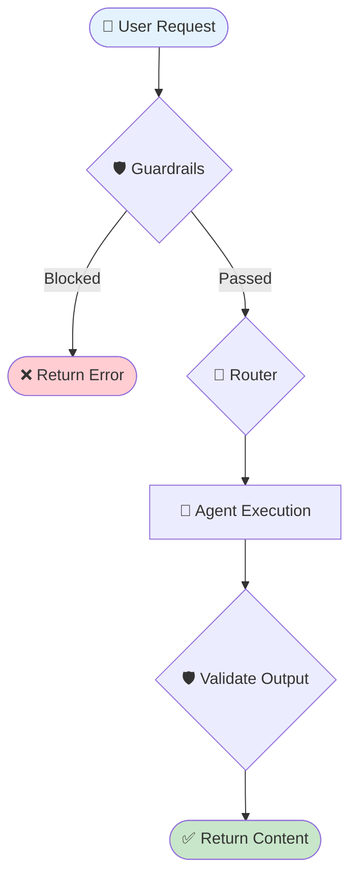

# 🔄 REACH LangGraph Architecture Documentation

This documentation explains the decision-making process and architecture of the multi-agent system in REACH (Real Estate Automated Content Hub).

## Overview

REACH uses LangGraph to orchestrate multiple specialized agents. The workflow follows a structured decision tree that ensures:
1. All requests pass through guardrails validation
2. Requests are routed to the most appropriate agent
3. Generated content is validated before returning to the user

## Documentation Index

### Core Architecture

| Document | Description |
|----------|-------------|
| [📄 Main Workflow](./architecture/01_main_workflow.md) | Complete workflow from user request to content delivery |
| [📊 GraphState Structure](./architecture/02_graph_state.md) | State management structure and data models |
| [🛡️ Guardrails](./architecture/03_guardrails.md) | Safety and topical guardrails validation |
| [🎯 Content Router](./architecture/04_content_router.md) | Routing logic and agent selection |

### Specialized Workflows

| Document | Description |
|----------|-------------|
| [📸 Instagram Flow](./architecture/05_instagram_flow.md) | Instagram post and caption generation |
| [🤖 Agent Routing](./architecture/06_agent_routing.md) | How requests are routed to specific agents |
| [📚 Research Workflow](./architecture/08_research_workflow.md) | Research-first content creation |

### System Components

| Document | Description |
|----------|-------------|
| [📋 State Management](./architecture/07_state_management.md) | Session and conversation state management |
| [⚠️ Error Handling](./architecture/09_error_handling.md) | Error handling and recovery mechanisms |
| [📖 API Reference](./architecture/10_api_reference.md) | Complete API documentation |

## Quick Reference

### Main Workflow Diagram



### Available Agents

| Agent | Purpose | Trigger Keywords |
|-------|---------|------------------|
| 🔍 Research Agent | Research topics using SERP API | research, find, analyze |
| 📝 Blog Writer | SEO-optimized blog posts | blog, article, write |
| 💼 LinkedIn Writer | Professional LinkedIn posts | linkedin, professional |
| 📸 Instagram Writer | Captions with hashtags | instagram, caption |
| 🖼️ Image Generator | Property images via Imagen | image, picture, generate |
| 📊 Content Strategist | Marketing strategies | strategy, plan, campaign |
| 🤖 Query Handler | General queries (fallback) | (default) |

### Key Decision Points

1. **Guardrails Gate** - Safety check → Topical check
2. **Pattern Matching** - High confidence routing (0.9)
3. **Keyword Scoring** - Medium confidence routing (0.3-0.8)
4. **History Context** - Low confidence routing (0.6)
5. **Output Validation** - Ensure safe content

### API Quick Start

```python
from src.workflow.langgraph_workflow import REACHGraph

# Initialize
graph = REACHGraph()

# Basic usage
result = await graph.run("Write a blog post about home staging")

# With research
result = await graph.run_with_research("market trends", content_type="blog")

# Instagram post
result = await graph.generate_instagram_post("Modern kitchen photo")
```

## Performance Considerations

- **Sequential Validation**: Safety check runs before topical check (fail-fast)
- **Pattern Matching First**: High-confidence routing without scoring overhead
- **Caching**: Session state caches conversation history for context
- **Lazy Loading**: Agents are initialized on-demand
- **Async Operations**: All API calls are asynchronous

## File Structure

```
docs/
├── langgraph_flowchart.md          # This index file
└── architecture/
    ├── 01_main_workflow.md         # Main workflow documentation
    ├── 02_graph_state.md           # GraphState structure
    ├── 03_guardrails.md            # Guardrails documentation
    ├── 04_content_router.md        # Content router logic
    ├── 05_instagram_flow.md        # Instagram generation flow
    ├── 06_agent_routing.md         # Agent routing details
    ├── 07_state_management.md      # Session management
    ├── 08_research_workflow.md     # Research-first workflow
    ├── 09_error_handling.md        # Error handling
    └── 10_api_reference.md         # API reference
```

## Related Source Files

| File | Description |
|------|-------------|
| `src/workflow/langgraph_workflow.py` | Main workflow implementation |
| `src/workflow/state_management.py` | Session and state management |
| `src/core/router.py` | Content routing logic |
| `src/guardrails/guardrails_manager.py` | Guardrails manager |
| `src/guardrails/safety_guard.py` | Safety guardrail |
| `src/guardrails/topical_guard.py` | Topical guardrail |