# 🔄 REACH LangGraph Architecture Documentation

This documentation explains the decision-making process and architecture of the multi-agent system in REACH (Real Estate Automated Content Hub).

## Overview

REACH uses LangGraph to orchestrate multiple specialized agents. The workflow follows a structured decision tree that ensures:
1. All **user input** passes through guardrails validation (safety + topical)
2. Requests are routed to the most appropriate agent
3. Agent-generated content is **trusted and not blocked** (no output validation)
4. Content is streamed in real-time for better UX (text-only content)
5. Images are generated alongside content (blogs, Instagram posts)
6. All generated content is persisted to SQLite storage

> **Note:** Safety guardrails only validate user input prompts, not agent-generated content. This ensures agents can generate comprehensive content without false positives.

## New Features (v1.2)

### 🖼️ Automatic Image Generation
- **Blog posts** now include auto-generated header images based on the blog title
- **Instagram posts** generate both image AND caption in a single request
- Images are embedded as base64 data URIs in the response

### 📸 Enhanced Instagram Flow
- Single prompt generates complete Instagram post (image + caption + hashtags)
- Captions limited to 150 words with 20-30 hashtags
- Square (1:1) aspect ratio for Instagram-optimized images

### 🎯 Improved Content Routing
- Instagram keywords prioritized in router
- Pattern matching for "instagram", "ig", "insta" keywords
- Automatic detection of content type from prompt

### 🚀 Streaming Text Generation
- Real-time text streaming via `generate_stream()` method
- ChatGPT-like typing cursor effect in UI
- Automatic fallback to non-streaming for image/blog/Instagram requests

### 📋 One-Click Copy
- Copy buttons on all generated content
- JavaScript-based clipboard integration
- Visual feedback on successful copy

### 📚 Persistent Content History
- SQLite-based storage (`content_history.db`)
- Automatically keeps last 5 items per content type
- Filter, search, and manage saved content

## Documentation Index

### Core Architecture

| Document | Description |
|----------|-------------|
| [📄 Main Workflow](./architecture/01_main_workflow.md) | Complete workflow from user request to content delivery |
| [📊 GraphState Structure](./architecture/02_graph_state.md) | State management structure and data models |
| [🛡️ Guardrails](./architecture/03_guardrails.md) | Safety and topical guardrails validation |
| [🎯 Content Router](./architecture/04_content_router.md) | Routing logic and agent selection |

### Specialized Workflows

| Document | Description |
|----------|-------------|
| [📸 Instagram Flow](./architecture/05_instagram_flow.md) | Instagram post and caption generation |
| [🤖 Agent Routing](./architecture/06_agent_routing.md) | How requests are routed to specific agents |
| [📚 Research Workflow](./architecture/08_research_workflow.md) | Research-first content creation |

### System Components

| Document | Description |
|----------|-------------|
| [📋 State Management](./architecture/07_state_management.md) | Session and conversation state management |
| [⚠️ Error Handling](./architecture/09_error_handling.md) | Error handling and recovery mechanisms |
| [📖 API Reference](./architecture/10_api_reference.md) | Complete API documentation |

## Quick Reference

### Main Workflow Diagram

```mermaid
%%{init: {'theme': 'base', 'themeVariables': { 'primaryColor': '#58a6ff', 'primaryTextColor': '#ffffff', 'primaryBorderColor': '#58a6ff', 'lineColor': '#8b949e', 'secondaryColor': '#21262d', 'tertiaryColor': '#161b22', 'background': '#0d1117'}}}%%
flowchart TD
    START([🚀 User Request]) --> GUARDRAILS{🛡️ Guardrails<br/>Input Validation Only}
    GUARDRAILS -->|Blocked| END_BLOCKED([❌ Return Error])
    GUARDRAILS -->|Passed| ROUTER{🎯 Router}
    
    ROUTER -->|research| RESEARCH[🔍 Research Agent]
    ROUTER -->|blog| BLOG[📝 Blog Writer]
    ROUTER -->|linkedin| LINKEDIN[💼 LinkedIn Writer]
    ROUTER -->|instagram| INSTAGRAM[📸 Instagram Writer]
    ROUTER -->|image| IMAGE[🖼️ Image Generator]
    ROUTER -->|strategy| STRATEGY[📊 Content Strategist]
    ROUTER -->|general| GENERAL[🤖 Query Handler]
    
    BLOG --> BLOG_IMG[🖼️ Generate Header Image]
    BLOG_IMG --> SUCCESS
    
    INSTAGRAM --> IG_IMG[🖼️ Generate Post Image]
    IG_IMG --> IG_CAPTION[📝 Generate Caption]
    IG_CAPTION --> SUCCESS
    
    RESEARCH --> SUCCESS([✅ Return Content])
    LINKEDIN --> SUCCESS
    IMAGE --> SUCCESS
    STRATEGY --> SUCCESS
    GENERAL --> SUCCESS

    style START fill:#58a6ff,stroke:#79c0ff,stroke-width:2px,color:#ffffff
    style END_BLOCKED fill:#f85149,stroke:#ff7b72,stroke-width:2px,color:#ffffff
    style SUCCESS fill:#3fb950,stroke:#56d364,stroke-width:2px,color:#ffffff
    style GUARDRAILS fill:#d29922,stroke:#e3b341,stroke-width:2px,color:#ffffff
    style ROUTER fill:#a371f7,stroke:#bc8cff,stroke-width:2px,color:#ffffff
    style RESEARCH fill:#39d353,stroke:#56d364,stroke-width:2px,color:#ffffff
    style BLOG fill:#39d353,stroke:#56d364,stroke-width:2px,color:#ffffff
    style LINKEDIN fill:#39d353,stroke:#56d364,stroke-width:2px,color:#ffffff
    style INSTAGRAM fill:#f778ba,stroke:#ff9bce,stroke-width:2px,color:#ffffff
    style IMAGE fill:#39d353,stroke:#56d364,stroke-width:2px,color:#ffffff
    style STRATEGY fill:#39d353,stroke:#56d364,stroke-width:2px,color:#ffffff
    style GENERAL fill:#39d353,stroke:#56d364,stroke-width:2px,color:#ffffff
    style BLOG_IMG fill:#fb8f44,stroke:#ffa657,stroke-width:2px,color:#ffffff
    style IG_IMG fill:#fb8f44,stroke:#ffa657,stroke-width:2px,color:#ffffff
    style IG_CAPTION fill:#3fb950,stroke:#56d364,stroke-width:2px,color:#ffffff
```



> **Important:** Guardrails only validate **user input**, not agent-generated content. This prevents false positives where legitimate real estate terms might be incorrectly flagged.

### Blog Generation Flow (with ImagePromptAgent)

```mermaid
%%{init: {'theme': 'base', 'themeVariables': { 'primaryColor': '#58a6ff', 'primaryTextColor': '#ffffff', 'primaryBorderColor': '#58a6ff', 'lineColor': '#8b949e', 'secondaryColor': '#21262d', 'tertiaryColor': '#161b22', 'background': '#0d1117'}}}%%
flowchart TD
    START([📝 Blog Request]) --> WRITE[📝 BlogWriterAgent<br/>Generate Blog Content]
    WRITE --> CHECK{🛡️ Guardrails Check}
    CHECK -->|Blocked| SKIP[Skip Image]
    CHECK -->|Passed| PROMPT[🎯 ImagePromptAgent<br/>Analyze Blog & Create Prompt]
    PROMPT --> GENERATE[🖼️ ImageGeneratorAgent<br/>Generate Header Image]
    GENERATE --> COMBINE[Combine Image + Blog]
    SKIP --> COMBINE
    COMBINE --> RETURN([✅ Return Complete Blog])
    
    style START fill:#58a6ff,stroke:#79c0ff,stroke-width:2px,color:#ffffff
    style WRITE fill:#3fb950,stroke:#56d364,stroke-width:2px,color:#ffffff
    style CHECK fill:#d29922,stroke:#e3b341,stroke-width:2px,color:#ffffff
    style SKIP fill:#8b949e,stroke:#b1bac4,stroke-width:2px,color:#ffffff
    style PROMPT fill:#e3b341,stroke:#f0d75e,stroke-width:2px,color:#0d1117
    style GENERATE fill:#fb8f44,stroke:#ffa657,stroke-width:2px,color:#ffffff
    style COMBINE fill:#a371f7,stroke:#bc8cff,stroke-width:2px,color:#ffffff
    style RETURN fill:#3fb950,stroke:#56d364,stroke-width:2px,color:#ffffff
```



**Blog Image Generation Flow:**
1. **BlogWriterAgent** generates the full blog content
2. **ImagePromptAgent** (intermediary) analyzes the blog, extracts title/summary/themes
3. **ImagePromptAgent** creates an optimized image prompt
4. **ImageGeneratorAgent** generates ONE header image (16:9) from the prompt
5. Image is inserted into the blog content

### Instagram Generation Flow

```mermaid
%%{init: {'theme': 'base', 'themeVariables': { 'primaryColor': '#58a6ff', 'primaryTextColor': '#ffffff', 'primaryBorderColor': '#58a6ff', 'lineColor': '#8b949e', 'secondaryColor': '#21262d', 'tertiaryColor': '#161b22', 'background': '#0d1117'}}}%%
flowchart TD
    START([📸 Instagram Request]) --> CHECK{🔒 Safety Only<br/>No Topical Check}
    CHECK -->|Safe| IMAGE[🖼️ Generate 1:1 Image]
    CHECK -->|Unsafe| CAPTION_ONLY[Caption Only]
    IMAGE --> CAPTION[📝 Generate Caption + Hashtags]
    CAPTION_ONLY --> CAPTION
    CAPTION --> FORMAT[Format as Instagram Post]
    FORMAT --> RETURN([✅ Return Complete Post])
    
    style START fill:#f778ba,stroke:#ff9bce,stroke-width:2px,color:#ffffff
    style CHECK fill:#3fb950,stroke:#56d364,stroke-width:2px,color:#ffffff
    style IMAGE fill:#fb8f44,stroke:#ffa657,stroke-width:2px,color:#ffffff
    style CAPTION_ONLY fill:#8b949e,stroke:#b1bac4,stroke-width:2px,color:#ffffff
    style CAPTION fill:#3fb950,stroke:#56d364,stroke-width:2px,color:#ffffff
    style FORMAT fill:#a371f7,stroke:#bc8cff,stroke-width:2px,color:#ffffff
    style RETURN fill:#3fb950,stroke:#56d364,stroke-width:2px,color:#ffffff
```



> **Note:** Instagram posts use **SAFETY guardrails only** (no topical check). This allows creative freedom while still blocking inappropriate content like profanity, violence, or explicit material.

### Available Agents

| Agent | Purpose | Trigger Keywords | Image Generation | Guardrails |
|-------|---------|------------------|------------------|------------|
| 🔍 Research Agent | Research topics using SERP API | research, find, analyze | ❌ | Safety + Topical |
| 📝 Blog Writer | SEO-optimized blog posts | blog, article, write | ✅ Header Image (16:9) via ImagePromptAgent | Safety + Topical |
| 💼 LinkedIn Writer | Professional LinkedIn posts | linkedin, professional | ❌ | Safety + Topical |
| 📸 Instagram Writer | Captions with hashtags | instagram, ig, insta, caption | ✅ Post Image (1:1) | **Safety Only** |
| 🖼️ Image Generator | Property images via Imagen | image, picture, generate | ✅ Custom | Safety + Topical |
| 🎯 Image Prompt Agent | Creates optimized image prompts | (internal use) | ❌ (creates prompts only) | N/A |
| 📊 Content Strategist | Marketing strategies | strategy, plan, campaign | ❌ | Safety + Topical |
| 🤖 Query Handler | General queries (fallback) | (default) | ❌ | Safety + Topical |

> **Note:** Instagram posts use **Safety guardrails only** (no topical restriction). This allows creative freedom for social media content while still blocking inappropriate material.

### Content Type Detection Priority

The router checks content types in this order (first match wins):

1. **Instagram** (highest priority)
   - Keywords: instagram, ig post, ig caption, insta, hashtag, caption, reel, story
   - Patterns: `create instagram post`, `instagram caption for`, `photorealistic instagram`

2. **Research**
   - Keywords: research, find, search, look up, investigate, analyze
   - Patterns: `research about`, `what is`, `tell me about`

3. **Blog**
   - Keywords: blog, article, seo, guide, tutorial, how-to
   - Patterns: `write a blog`, `blog post about`

4. **LinkedIn**
   - Keywords: linkedin, professional, b2b, corporate
   - Patterns: `linkedin post`, `professional post`

5. **Image**
   - Keywords: image, picture, photo, visual, graphic
   - Patterns: `generate image`, `create picture`

6. **Strategy**
   - Keywords: strategy, plan, campaign, marketing
   - Patterns: `content strategy`, `marketing plan`

7. **General** (fallback)
   - Default when no specific type detected

### Key Decision Points

1. **Guardrails Gate** - Safety check → Topical check (user input only)
2. **Pattern Matching** - High confidence routing (0.9)
3. **Keyword Scoring** - Medium confidence routing (0.3-0.8)
4. **History Context** - Low confidence routing (0.6)

> **Note:** Output validation has been removed. Agent-generated content is trusted and returned directly to the user.

### Streaming vs Non-Streaming

| Content Type | Streaming | Reason |
|--------------|-----------|--------|
| Research | ✅ Yes | Text-only output |
| LinkedIn | ✅ Yes | Text-only output |
| Strategy | ✅ Yes | Text-only output |
| General | ✅ Yes | Text-only output |
| Blog | ❌ No | Generates header image |
| Instagram | ❌ No | Generates post image |
| Image | ❌ No | Image generation |

### API Quick Start

```python
from src.workflow.langgraph_workflow import REACHGraph

# Initialize
graph = REACHGraph()

# Basic usage - auto-routes to appropriate agent
result = await graph.run("Write a blog post about home staging")
# Returns: Blog content with header image

# Instagram post - generates image + caption
result = await graph.run("Create an Instagram post for a luxury condo")
# Returns: Image + caption with hashtags

# With research
result = await graph.run_with_research("market trends", content_type="blog")

# Direct Instagram post generation
result = await graph.generate_instagram_post("Modern kitchen photo")
```

## Performance Considerations

- **Sequential Validation**: Safety check runs before topical check (fail-fast)
- **Pattern Matching First**: High-confidence routing without scoring overhead
- **Caching**: Session state caches conversation history for context
- **Lazy Loading**: Agents are initialized on-demand
- **Async Operations**: All API calls are asynchronous
- **Image Generation**: Runs after text generation to avoid blocking

## File Structure

```
docs/
├── langgraph_flowchart.md          # This index file
└── architecture/
    ├── 01_main_workflow.md         # Main workflow documentation
    ├── 02_graph_state.md           # GraphState structure
    ├── 03_guardrails.md            # Guardrails documentation
    ├── 04_content_router.md        # Content router logic
    ├── 05_instagram_flow.md        # Instagram generation flow
    ├── 06_agent_routing.md         # Agent routing details
    ├── 07_state_management.md      # Session management
    ├── 08_research_workflow.md     # Research-first workflow
    ├── 09_error_handling.md        # Error handling
    └── 10_api_reference.md         # API reference
```

## Related Source Files

### Core Workflow
| File | Description |
|------|-------------|
| `src/workflow/langgraph_workflow.py` | Main workflow with blog/Instagram image generation |
| `src/workflow/state_management.py` | Session and state management |
| `src/core/router.py` | Content routing logic with Instagram priority |

### Agents
| File | Description |
|------|-------------|
| `src/agents/blog_writer.py` | Blog writer agent (uses ImagePromptAgent for images) |
| `src/agents/instagram_writer.py` | Instagram caption writer |
| `src/agents/image_generator.py` | Image generation agent (Google Imagen) |
| `src/agents/image_prompt_agent.py` | **NEW** Intermediary agent that creates optimized image prompts |
| `src/agents/linkedin_writer.py` | LinkedIn post writer |
| `src/agents/research_agent.py` | Research agent |
| `src/agents/content_strategist.py` | Content strategy agent |
| `src/agents/query_handler.py` | General query handler |

### Guardrails
| File | Description |
|------|-------------|
| `src/guardrails/guardrails_manager.py` | Guardrails manager |
| `src/guardrails/safety_guard.py` | Safety guardrail (profanity filter) |
| `src/guardrails/topical_guard.py` | Topical guardrail (Real Estate only) |

### Integrations
| File | Description |
|------|-------------|
| `src/integrations/gemini_client.py` | Gemini LLM client with streaming support |
| `src/integrations/imagen_client.py` | Google Imagen image generation |
| `src/integrations/serp_client.py` | SERP API for web research |

### Utilities
| File | Description |
|------|-------------|
| `src/utils/content_storage.py` | SQLite-based content history storage |
| `src/utils/content_optimization.py` | SEO and content optimization |
| `src/utils/quality_validation.py` | Content quality validation |
| `src/utils/export_tools.py` | Content export (Markdown, HTML, JSON) |

### Web Application
| File | Description |
|------|-------------|
| `src/web_app/streamlit_app.py` | Streamlit UI with chat, history, and tools tabs |