# 🔄 REACH LangGraph Architecture Documentation

This documentation explains the decision-making process and architecture of the multi-agent system in REACH (Real Estate Automated Content Hub).

## Overview

REACH uses LangGraph to orchestrate multiple specialized agents. The workflow follows a structured decision tree that ensures:
1. All requests pass through guardrails validation
2. Requests are routed to the most appropriate agent
3. Generated content is validated before returning to the user
4. Content is streamed in real-time for better UX
5. All generated content is persisted to SQLite storage

## New Features (v1.1)

### 🚀 Streaming Text Generation
- Real-time text streaming via `generate_stream()` method
- ChatGPT-like typing cursor effect in UI
- Automatic fallback to non-streaming for image requests

### 📋 One-Click Copy
- Copy buttons on all generated content
- JavaScript-based clipboard integration
- Visual feedback on successful copy

### 📚 Persistent Content History
- SQLite-based storage (`content_history.db`)
- Automatically keeps last 5 items per content type
- Filter, search, and manage saved content

## Documentation Index

### Core Architecture

| Document | Description |
|----------|-------------|
| [📄 Main Workflow](./architecture/01_main_workflow.md) | Complete workflow from user request to content delivery |
| [📊 GraphState Structure](./architecture/02_graph_state.md) | State management structure and data models |
| [🛡️ Guardrails](./architecture/03_guardrails.md) | Safety and topical guardrails validation |
| [🎯 Content Router](./architecture/04_content_router.md) | Routing logic and agent selection |

### Specialized Workflows

| Document | Description |
|----------|-------------|
| [📸 Instagram Flow](./architecture/05_instagram_flow.md) | Instagram post and caption generation |
| [🤖 Agent Routing](./architecture/06_agent_routing.md) | How requests are routed to specific agents |
| [📚 Research Workflow](./architecture/08_research_workflow.md) | Research-first content creation |

### System Components

| Document | Description |
|----------|-------------|
| [📋 State Management](./architecture/07_state_management.md) | Session and conversation state management |
| [⚠️ Error Handling](./architecture/09_error_handling.md) | Error handling and recovery mechanisms |
| [📖 API Reference](./architecture/10_api_reference.md) | Complete API documentation |

## Quick Reference

### Main Workflow Diagram

```mermaid
flowchart TD
    START([🚀 User Request]) --> GUARDRAILS{🛡️ Guardrails}
    GUARDRAILS -->|Blocked| END_BLOCKED([❌ Return Error])
    GUARDRAILS -->|Passed| ROUTER{🎯 Router}
    ROUTER --> AGENT[🤖 Agent Execution]
    AGENT --> VALIDATE{🛡️ Validate Output}
    VALIDATE --> SUCCESS([✅ Return Content])

    style START fill:#e3f2fd
    style END_BLOCKED fill:#ffcdd2
    style SUCCESS fill:#c8e6c9
```



### Available Agents

| Agent | Purpose | Trigger Keywords |
|-------|---------|------------------|
| 🔍 Research Agent | Research topics using SERP API | research, find, analyze |
| 📝 Blog Writer | SEO-optimized blog posts | blog, article, write |
| 💼 LinkedIn Writer | Professional LinkedIn posts | linkedin, professional |
| 📸 Instagram Writer | Captions with hashtags | instagram, caption |
| 🖼️ Image Generator | Property images via Imagen | image, picture, generate |
| 📊 Content Strategist | Marketing strategies | strategy, plan, campaign |
| 🤖 Query Handler | General queries (fallback) | (default) |

### Key Decision Points

1. **Guardrails Gate** - Safety check → Topical check
2. **Pattern Matching** - High confidence routing (0.9)
3. **Keyword Scoring** - Medium confidence routing (0.3-0.8)
4. **History Context** - Low confidence routing (0.6)
5. **Output Validation** - Ensure safe content

### API Quick Start

```python
from src.workflow.langgraph_workflow import REACHGraph

# Initialize
graph = REACHGraph()

# Basic usage
result = await graph.run("Write a blog post about home staging")

# With research
result = await graph.run_with_research("market trends", content_type="blog")

# Instagram post
result = await graph.generate_instagram_post("Modern kitchen photo")
```

## Performance Considerations

- **Sequential Validation**: Safety check runs before topical check (fail-fast)
- **Pattern Matching First**: High-confidence routing without scoring overhead
- **Caching**: Session state caches conversation history for context
- **Lazy Loading**: Agents are initialized on-demand
- **Async Operations**: All API calls are asynchronous

## File Structure

```
docs/
├── langgraph_flowchart.md          # This index file
└── architecture/
    ├── 01_main_workflow.md         # Main workflow documentation
    ├── 02_graph_state.md           # GraphState structure
    ├── 03_guardrails.md            # Guardrails documentation
    ├── 04_content_router.md        # Content router logic
    ├── 05_instagram_flow.md        # Instagram generation flow
    ├── 06_agent_routing.md         # Agent routing details
    ├── 07_state_management.md      # Session management
    ├── 08_research_workflow.md     # Research-first workflow
    ├── 09_error_handling.md        # Error handling
    └── 10_api_reference.md         # API reference
```

## Related Source Files

### Core Workflow
| File | Description |
|------|-------------|
| `src/workflow/langgraph_workflow.py` | Main workflow implementation with streaming support |
| `src/workflow/state_management.py` | Session and state management |
| `src/core/router.py` | Content routing logic |

### Guardrails
| File | Description |
|------|-------------|
| `src/guardrails/guardrails_manager.py` | Guardrails manager |
| `src/guardrails/safety_guard.py` | Safety guardrail |
| `src/guardrails/topical_guard.py` | Topical guardrail |

### Integrations
| File | Description |
|------|-------------|
| `src/integrations/gemini_client.py` | Gemini LLM client with streaming support |
| `src/integrations/imagen_client.py` | Google Imagen image generation |
| `src/integrations/serp_client.py` | SERP API for web research |

### Utilities
| File | Description |
|------|-------------|
| `src/utils/content_storage.py` | SQLite-based content history storage |
| `src/utils/content_optimization.py` | SEO and content optimization |
| `src/utils/quality_validation.py` | Content quality validation |
| `src/utils/export_tools.py` | Content export (Markdown, HTML, JSON) |

### Web Application
| File | Description |
|------|-------------|
| `src/web_app/streamlit_app.py` | Streamlit UI with streaming and history tabs |
