# 🔄 REACH LangGraph Agent Decision Flowchart

This document explains the decision-making process of the multi-agent system in REACH.

## Overview

REACH uses LangGraph to orchestrate multiple specialized agents. The workflow follows a structured decision tree that ensures:
1. All requests pass through guardrails validation
2. Requests are routed to the most appropriate agent
3. Generated content is validated before returning to the user

## Main Workflow Flowchart

```mermaid
flowchart TD
    START([🚀 User Request]) --> GUARDRAILS{🛡️ Guardrails<br/>Validation}
    
    GUARDRAILS -->|Safety Check| SAFETY{🔒 Safety Guard}
    SAFETY -->|Contains Profanity| BLOCKED_SAFETY[❌ Block Request<br/>Return Safety Message]
    SAFETY -->|Clean Content| TOPICAL{📋 Topical Guard}
    
    TOPICAL -->|Off-Topic| BLOCKED_TOPIC[❌ Block Request<br/>Return Topic Message]
    TOPICAL -->|Real Estate Topic| ROUTE{🎯 Content Router}
    
    ROUTE -->|Analyze Intent| CLASSIFY[🤖 Classify User Intent]
    
    CLASSIFY -->|Research Keywords| RESEARCH[🔍 Research Agent]
    CLASSIFY -->|Blog Keywords| BLOG[📝 Blog Writer Agent]
    CLASSIFY -->|LinkedIn Keywords| LINKEDIN[💼 LinkedIn Writer Agent]
    CLASSIFY -->|Instagram/Caption| INSTAGRAM[📸 Instagram Writer Agent]
    CLASSIFY -->|Image Keywords| IMAGE[🖼️ Image Generator Agent]
    CLASSIFY -->|Strategy Keywords| STRATEGY[📊 Content Strategist Agent]
    CLASSIFY -->|General/Unknown| GENERAL[🤖 Query Handler Agent]
    
    RESEARCH --> VALIDATE_OUTPUT{🛡️ Validate Output}
    BLOG --> VALIDATE_OUTPUT
    LINKEDIN --> VALIDATE_OUTPUT
    INSTAGRAM --> VALIDATE_OUTPUT
    IMAGE --> VALIDATE_OUTPUT
    STRATEGY --> VALIDATE_OUTPUT
    GENERAL --> VALIDATE_OUTPUT
    
    VALIDATE_OUTPUT -->|Safe| SUCCESS[✅ Return Content]
    VALIDATE_OUTPUT -->|Unsafe| SANITIZE[🧹 Sanitize/Replace]
    SANITIZE --> SUCCESS
    
    BLOCKED_SAFETY --> END([📤 Return to User])
    BLOCKED_TOPIC --> END
    SUCCESS --> END

    style START fill:#e3f2fd
    style END fill:#e3f2fd
    style GUARDRAILS fill:#fff3e0
    style SAFETY fill:#ffebee
    style TOPICAL fill:#ffebee
    style BLOCKED_SAFETY fill:#ffcdd2
    style BLOCKED_TOPIC fill:#ffcdd2
    style ROUTE fill:#e8f5e9
    style SUCCESS fill:#c8e6c9
```

## Guardrails Decision Flow

```mermaid
flowchart TD
    INPUT([📥 User Input]) --> SAFETY_CHECK{🔒 Safety Check}
    
    subgraph "Safety Guard"
        SAFETY_CHECK -->|Check| PROFANITY{Contains<br/>Profanity?}
        PROFANITY -->|Yes| LEETSPEAK{Check<br/>Leetspeak?}
        LEETSPEAK -->|Detected| BLOCK_PROF[❌ Block]
        PROFANITY -->|No| INAPPROPRIATE{Inappropriate<br/>Content?}
        LEETSPEAK -->|Clean| INAPPROPRIATE
        INAPPROPRIATE -->|Violence/Hate/Adult| BLOCK_INAPP[❌ Block]
        INAPPROPRIATE -->|Clean| PASS_SAFETY[✅ Pass Safety]
    end
    
    PASS_SAFETY --> TOPIC_CHECK{📋 Topic Check}
    
    subgraph "Topical Guard"
        TOPIC_CHECK -->|Analyze| RE_KEYWORDS{Real Estate<br/>Keywords?}
        RE_KEYWORDS -->|Found| PASS_TOPIC[✅ Pass Topic]
        RE_KEYWORDS -->|Not Found| OFF_TOPIC{Off-Topic<br/>Keywords?}
        OFF_TOPIC -->|Programming/Cooking/etc| BLOCK_TOPIC[❌ Block]
        OFF_TOPIC -->|Ambiguous| LLM_CHECK{🤖 LLM<br/>Semantic Check}
        LLM_CHECK -->|Real Estate| PASS_TOPIC
        LLM_CHECK -->|Off-Topic| BLOCK_TOPIC
    end
    
    BLOCK_PROF --> RETURN_ERROR([Return Error Message])
    BLOCK_INAPP --> RETURN_ERROR
    BLOCK_TOPIC --> RETURN_ERROR
    PASS_TOPIC --> CONTINUE([Continue to Router])

    style INPUT fill:#e3f2fd
    style BLOCK_PROF fill:#ffcdd2
    style BLOCK_INAPP fill:#ffcdd2
    style BLOCK_TOPIC fill:#ffcdd2
    style PASS_SAFETY fill:#c8e6c9
    style PASS_TOPIC fill:#c8e6c9
```

## Content Router Decision Logic

```mermaid
flowchart TD
    REQUEST([📥 Validated Request]) --> ANALYZE[🔍 Analyze Request Text]
    
    ANALYZE --> KEYWORDS{🏷️ Keyword Detection}
    
    KEYWORDS --> CHECK_RESEARCH{Contains:<br/>'research', 'find out',<br/>'investigate', 'analyze'}
    CHECK_RESEARCH -->|Yes| RESEARCH_AGENT[🔍 Research Agent]
    CHECK_RESEARCH -->|No| CHECK_BLOG
    
    CHECK_BLOG{Contains:<br/>'blog', 'article',<br/>'write about', 'post'}
    CHECK_BLOG -->|Yes| BLOG_AGENT[📝 Blog Writer]
    CHECK_BLOG -->|No| CHECK_LINKEDIN
    
    CHECK_LINKEDIN{Contains:<br/>'linkedin', 'professional',<br/>'network post'}
    CHECK_LINKEDIN -->|Yes| LINKEDIN_AGENT[💼 LinkedIn Writer]
    CHECK_LINKEDIN -->|No| CHECK_INSTAGRAM
    
    CHECK_INSTAGRAM{Contains:<br/>'instagram', 'caption',<br/>'hashtag', 'social media'}
    CHECK_INSTAGRAM -->|Yes| INSTAGRAM_AGENT[📸 Instagram Writer]
    CHECK_INSTAGRAM -->|No| CHECK_IMAGE
    
    CHECK_IMAGE{Contains:<br/>'image', 'picture',<br/>'generate', 'visual'}
    CHECK_IMAGE -->|Yes| IMAGE_AGENT[🖼️ Image Generator]
    CHECK_IMAGE -->|No| CHECK_STRATEGY
    
    CHECK_STRATEGY{Contains:<br/>'strategy', 'plan',<br/>'calendar', 'campaign'}
    CHECK_STRATEGY -->|Yes| STRATEGY_AGENT[📊 Content Strategist]
    CHECK_STRATEGY -->|No| GENERAL_AGENT[🤖 Query Handler]

    style REQUEST fill:#e3f2fd
    style RESEARCH_AGENT fill:#e8f5e9
    style BLOG_AGENT fill:#e8f5e9
    style LINKEDIN_AGENT fill:#e8f5e9
    style INSTAGRAM_AGENT fill:#e8f5e9
    style IMAGE_AGENT fill:#e8f5e9
    style STRATEGY_AGENT fill:#e8f5e9
    style GENERAL_AGENT fill:#fff3e0
```

## Instagram Post Generation Flow

```mermaid
flowchart TD
    START([📸 Instagram Post Request]) --> VALIDATE{🛡️ Validate Request}
    
    VALIDATE -->|Blocked| ERROR[❌ Return Error]
    VALIDATE -->|Passed| OPTIONS{Generation Options}
    
    OPTIONS -->|Image + Caption| BOTH[Generate Both]
    OPTIONS -->|Caption Only| CAPTION_ONLY[Caption Only]
    OPTIONS -->|Image Only| IMAGE_ONLY[Image Only]
    
    BOTH --> GEN_IMAGE[🖼️ Generate Image<br/>via Imagen]
    GEN_IMAGE --> GEN_CAPTION[📝 Generate Caption<br/>via Instagram Agent]
    GEN_CAPTION --> ADD_HASHTAGS[#️⃣ Add Hashtags]
    
    CAPTION_ONLY --> GEN_CAPTION_SOLO[📝 Generate Caption]
    GEN_CAPTION_SOLO --> ADD_HASHTAGS_SOLO[#️⃣ Add Hashtags]
    
    IMAGE_ONLY --> GEN_IMAGE_SOLO[🖼️ Generate Image]
    
    ADD_HASHTAGS --> VALIDATE_OUTPUT{🛡️ Validate Output}
    ADD_HASHTAGS_SOLO --> VALIDATE_OUTPUT
    GEN_IMAGE_SOLO --> VALIDATE_OUTPUT
    
    VALIDATE_OUTPUT -->|Safe| COMBINE[📦 Combine Results]
    VALIDATE_OUTPUT -->|Unsafe| SANITIZE[🧹 Sanitize Content]
    SANITIZE --> COMBINE
    
    COMBINE --> RETURN([✅ Return Instagram Post])
    ERROR --> END([📤 Return to User])
    RETURN --> END

    style START fill:#e3f2fd
    style ERROR fill:#ffcdd2
    style RETURN fill:#c8e6c9
    style GEN_IMAGE fill:#fff3e0
    style GEN_CAPTION fill:#fff3e0
    style ADD_HASHTAGS fill:#e8f5e9
```

## Agent Selection Priority

The router uses the following priority order when multiple keywords match:

| Priority | Agent | Trigger Keywords |
|----------|-------|------------------|
| 1 | Research Agent | research, investigate, find out, analyze, study |
| 2 | Blog Writer | blog, article, write about, long-form, SEO |
| 3 | LinkedIn Writer | linkedin, professional post, network |
| 4 | Instagram Writer | instagram, caption, hashtag, social post |
| 5 | Image Generator | image, picture, photo, visual, generate |
| 6 | Content Strategist | strategy, plan, calendar, campaign, schedule |
| 7 | Query Handler | (default fallback for general queries) |

## State Management

## Error Handling Flow

```mermaid
flowchart TD
    ERROR([⚠️ Error Occurred]) --> TYPE{Error Type}
    
    TYPE -->|API Error| API_RETRY{Retry Count < 3?}
    API_RETRY -->|Yes| RETRY[🔄 Retry Request]
    API_RETRY -->|No| FALLBACK[📋 Use Fallback]
    RETRY --> SUCCESS{Success?}
    SUCCESS -->|Yes| RETURN[✅ Return Result]
    SUCCESS -->|No| API_RETRY
    
    TYPE -->|Guardrails Block| BLOCK_MSG[📝 Return Block Message]
    
    TYPE -->|Validation Error| VALIDATE_MSG[📝 Return Validation Error]
    
    TYPE -->|Unknown Error| LOG[📋 Log Error]
    LOG --> GENERIC_MSG[📝 Return Generic Error]
    
    FALLBACK --> RETURN
    BLOCK_MSG --> END([📤 Return to User])
    VALIDATE_MSG --> END
    GENERIC_MSG --> END
    RETURN --> END

    style ERROR fill:#ffebee
    style RETURN fill:#c8e6c9
    style BLOCK_MSG fill:#fff3e0
    style VALIDATE_MSG fill:#fff3e0
    style GENERIC_MSG fill:#fff3e0
```

## Session State Flow

## Key Decision Points Summary

1. **Guardrails Gate**: All requests must pass safety and topical validation
2. **Intent Classification**: Router analyzes keywords to determine the best agent
3. **Agent Execution**: Selected agent processes the request using appropriate APIs
4. **Output Validation**: Generated content is validated before returning
5. **Error Recovery**: Graceful handling with retries and fallbacks

## Performance Considerations

- **Parallel Validation**: Safety and topical checks can run in parallel
- **Caching**: Session state caches conversation history for context
- **Lazy Loading**: Agents are initialized on-demand
- **Async Operations**: All API calls are asynchronous for better performance